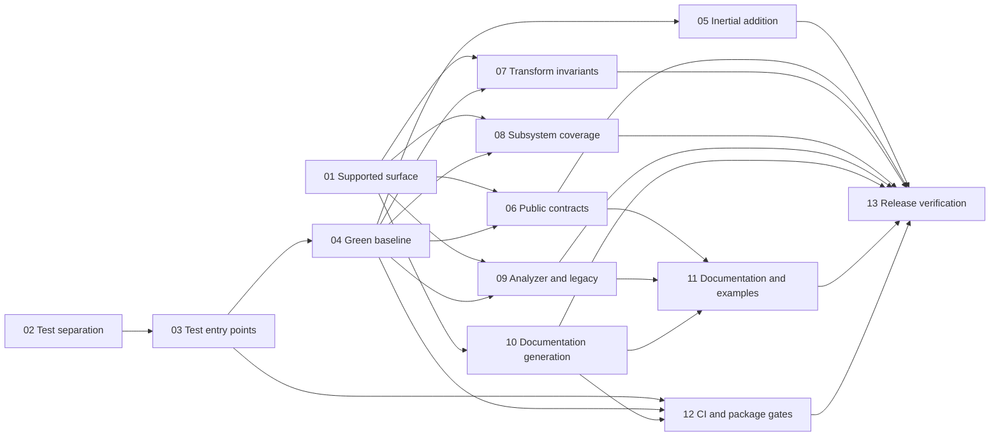

# WaveVortexModel v4.2.1 Stabilization

Status: Published to GitHub on 2026-08-07. See the [`v4.2.1 Stabilization` milestone](https://github.com/JeffreyEarly/wave-vortex-model/milestone/1).

This document is the source-controlled plan for the GitHub milestone and issues needed to stabilize WaveVortexModel 4.2.0 before larger upgrades begin. Stable planning IDs such as `WVM-421-01` remain in the published issue bodies and map to GitHub issue numbers in the Publication mapping section.

## Milestone

| Field | Value |
| --- | --- |
| Title | `v4.2.1 Stabilization` |
| Due date | None initially |
| Assignees | None initially |

### Milestone description

Stabilize the existing WaveVortexModel 4.2.0 behavior by establishing a deterministic test contract, fixing confirmed defects, adding high-value regression coverage, bringing documentation into agreement with the supported API, and adding clean-package release gates. The milestone includes the completed behavior-preserving compact two-dimensional Fourier-mapping optimization from issues #69–#70 and PR #82. That internal performance change is an approved exception to the original broad-refactoring boundary because it adds no scientific capability, preserves the public numerical contract, and passed an explicit performance gate. WaveVortexModel 4.2.1 does not include the optional FFTW backend.

### Boundaries

Included work:

- Classify the supported 4.2.x API and record experimental, deprecated, and internal features.
- Separate automated tests from historical investigations, scratch scripts, and benchmarks.
- Make supported test suites deterministic and green.
- Fix confirmed correctness defects with focused regression tests.
- Add coverage for scientific invariants and important package boundaries.
- Make source and generated documentation current and reproducible.
- Add continuous integration and clean MPM package verification.
- Include the completed compact two-dimensional Fourier mapping and its canonical performance record.

Excluded work:

- New physical models, forcing mechanisms, observing systems, transforms, or numerical algorithms.
- Broad source modernization or style-only refactoring.
- Breaking public API changes without an explicit compatibility and deprecation decision.
- Direct edits to released package snapshots under `OceanKit/WaveVortexModel-*`.
- The optional FFTW backend and its package dependency.

### Definition of done

The milestone is complete when:

- The supported 4.2.x feature matrix is documented and all release decisions are resolved.
- One canonical interface runs smoke, full, exhaustive, and optional test categories.
- Every supported category passes deterministically without discovery warnings, path warnings, or repository artifacts.
- Confirmed v4.2.0 defects have regression tests and fixes, or are explicitly deferred with documented user impact.
- Critical transform, integration, forcing, observing, output, and persistence behavior is covered.
- The README, API documentation, links, and executable examples match supported behavior.
- Documentation rebuilds reproducibly from canonical source.
- CI tests a clean MPM installation and the exported OceanKit snapshot.
- The changelog and package metadata describe the final v4.2.1 contents without unannounced API breaks.

## Labels

Reuse an existing label when its name already exists. Do not overwrite an existing label's color or description merely to match this table.

| Label | Suggested color | Description |
| --- | --- | --- |
| `bug` | Existing | Something is not behaving as intended. |
| `documentation` | Existing | Documentation source, generated API pages, examples, or links. |
| `maintenance` | `5319e7` | Stabilization, cleanup, or internal maintainability work. |
| `tests` | `1d76db` | Automated tests, fixtures, runners, or coverage. |
| `decision` | `d4c5f9` | Requires an explicit supported-API or compatibility decision. |
| `ci` | `0e8a16` | Continuous integration or release verification. |
| `release-blocker` | `b60205` | Must be resolved or explicitly deferred before v4.2.1. |

## Issue inventory and dependency order

| Planning ID | Issue title | Labels | Dependencies |
| --- | --- | --- | --- |
| `WVM-421-01` | Define the supported WaveVortexModel 4.2.x surface | `maintenance`, `decision`, `documentation`, `release-blocker` | None |
| `WVM-421-02` | Separate formal tests from development and research artifacts | `maintenance`, `tests`, `release-blocker` | None |
| `WVM-421-03` | Add canonical smoke, full, exhaustive, and optional test entry points | `maintenance`, `tests`, `ci`, `release-blocker` | `WVM-421-02` |
| `WVM-421-04` | Restore a deterministic green test baseline | `bug`, `tests`, `release-blocker` | `WVM-421-03` |
| `WVM-421-05` | Investigate and fix inertial-motion addition | `bug`, `tests`, `release-blocker` | `WVM-421-04` |
| `WVM-421-06` | Resolve exact interpolation and placeholder public-method contracts | `bug`, `decision`, `tests`, `documentation`, `release-blocker` | `WVM-421-01`, `WVM-421-04` |
| `WVM-421-07` | Add core transform invariant coverage | `tests`, `maintenance`, `release-blocker` | `WVM-421-01`, `WVM-421-04` |
| `WVM-421-08` | Add model, forcing, observing, output, and persistence coverage | `tests`, `maintenance`, `release-blocker` | `WVM-421-01`, `WVM-421-04` |
| `WVM-421-09` | Resolve correctness-related analyzer findings and legacy package artifacts | `bug`, `maintenance`, `decision`, `release-blocker` | `WVM-421-01`, `WVM-421-04` |
| `WVM-421-10` | Stabilize documentation generation | `documentation`, `maintenance`, `release-blocker` | `WVM-421-01` |
| `WVM-421-11` | Rewrite current documentation and add executable examples | `documentation`, `release-blocker` | `WVM-421-06`, `WVM-421-09`, `WVM-421-10` |
| `WVM-421-12` | Add continuous integration and clean-package release gates | `ci`, `tests`, `maintenance`, `release-blocker` | `WVM-421-03`, `WVM-421-04`, `WVM-421-10` |
| `WVM-421-13` | Prepare and verify the v4.2.1 maintenance release | `maintenance`, `ci`, `documentation`, `release-blocker` | `WVM-421-05` through `WVM-421-12` |

Recommended execution:

1. Begin `WVM-421-01` and `WVM-421-02` independently.
2. Complete `WVM-421-03` and then `WVM-421-04` to establish the trusted baseline.
3. Work on `WVM-421-05` through `WVM-421-09` in parallel where dependencies permit.
4. Begin `WVM-421-10` once the supported surface is known, then complete `WVM-421-11` and `WVM-421-12`.
5. Use `WVM-421-13` as the final release checklist rather than as a container for unfinished implementation.

## Issue drafts

Each section between `issue-body:start` and `issue-body:end` is the complete proposed GitHub issue body. The metadata immediately above it supplies the GitHub title, milestone, and labels.

### WVM-421-01: Define the supported WaveVortexModel 4.2.x surface

**Milestone:** `v4.2.1 Stabilization`
**Labels:** `maintenance`, `decision`, `documentation`, `release-blocker`
**Dependencies:** None

<!-- issue-body:start WVM-421-01 -->
#### Summary

Define which WaveVortexModel classes and behaviors are supported in the 4.2.x line before tests, bug fixes, and documentation make incompatible assumptions. Record the result as an explicit feature matrix that downstream stabilization issues can use as their contract.

Planning ID: `WVM-421-01`

#### Work

- Inventory the transform families: constant-stratification hydrostatic and nonhydrostatic, variable-stratification hydrostatic, Boussinesq, barotropic QG, stratified QG, and off-grid transforms.
- Inventory fixed and adaptive integrators, forcing classes, observing systems, model-output classes, fast-transform backends, and optional toolbox behavior.
- Classify each feature as stable, experimental, deprecated, or internal for 4.2.x.
- Resolve the intended latitude domain and document whether equatorial and polar limits are valid.
- Decide the 4.2.x contract for exact interpolation, off-grid pressure, `intZF`, `intZG`, `hasMeanPressureDifference`, and other public-looking placeholder methods.
- Record compatibility expectations for historically misspelled public names.
- Identify which classifications or compatibility decisions must be mentioned in the v4.2.1 changelog.

#### Acceptance criteria

- A reviewed feature matrix names every inventoried subsystem and its classification.
- Each public placeholder behavior has an explicit implement, deprecate, make-internal, or defer decision.
- Latitude validation expectations are stated precisely enough to test.
- Optional dependencies and backends have an explicit test expectation.
- Dependent issues can implement behavior without deciding product scope themselves.

#### Dependencies

None.

#### Out of scope

- Implementing the decisions made here.
- Adding new transforms, forcing mechanisms, or physical capabilities.
<!-- issue-body:end WVM-421-01 -->

### WVM-421-02: Separate formal tests from development and research artifacts

**Milestone:** `v4.2.1 Stabilization`
**Labels:** `maintenance`, `tests`, `release-blocker`
**Dependencies:** None

<!-- issue-body:start WVM-421-02 -->
#### Summary

Make `UnitTests` an unambiguous automated-test root by moving historical investigations, scratch scripts, and benchmarks to clearly named authoring-only locations. Preserve the content and history of useful research scripts without allowing MATLAB test discovery to execute them accidentally.

Planning ID: `WVM-421-02`

#### Work

- Keep formal `matlab.unittest.TestCase` classes, test helpers, constraints, the test runner compatibility entry point, and private test functions under `UnitTests`.
- Move `UnitTests/MiscTests` to `DeveloperExperiments/LegacyTests` using history-preserving moves.
- Move `IsolatedUnitTestScratch.m` to `DeveloperExperiments` and `ProfileableSpeedTest.m` to `Benchmarks`.
- Classify any ambiguous script by whether it asserts deterministic behavior, explores scientific behavior interactively, or measures performance.
- Update references to moved files without changing their scientific content.
- Ensure development and benchmark folders are not runtime package paths unless explicitly justified.

#### Acceptance criteria

- Default test discovery under `UnitTests` finds only intentional automated tests.
- No scratch, plotting, profiling, or personal-path script is discovered as a test.
- Moved files remain available in clearly named authoring folders.
- The move introduces no production-code behavior change.
- The repository contains no newly generated data or test output.

#### Dependencies

None.

#### Out of scope

- Repairing failing formal tests.
- Rewriting or modernizing historical research scripts.
- Changing production MATLAB APIs.
<!-- issue-body:end WVM-421-02 -->

### WVM-421-03: Add canonical smoke, full, exhaustive, and optional test entry points

**Milestone:** `v4.2.1 Stabilization`
**Labels:** `maintenance`, `tests`, `ci`, `release-blocker`
**Dependencies:** `WVM-421-02`

<!-- issue-body:start WVM-421-03 -->
#### Summary

Provide one supported interface for running the WaveVortexModel test categories on a developer machine and in CI. Preserve `RunAllUnitTests.m` only as a thin compatibility entry point so its name once again reflects its behavior.

Planning ID: `WVM-421-03`

#### Work

- Add canonical build tasks compatible with the package's R2024b release floor.
- Define a fast smoke category for ordinary development feedback.
- Define a full category for supported deterministic tests that do not require optional backends or exhaustive parameter sweeps.
- Define an exhaustive category for large spectral-differentiation and equivalent numerical matrices.
- Define an optional category for explicitly supported toolbox or backend configurations such as FFTW.
- Make category membership visible in test metadata rather than encoded in commented-out test parameters.
- Return nonzero status when a selected suite fails or is incomplete.
- Produce a concise summary suitable for CI logs while preserving detailed failure diagnostics.

#### Acceptance criteria

- Documented commands run each category independently from the repository root.
- `RunAllUnitTests.m` delegates to the canonical full-suite interface rather than selecting one class.
- Test discovery produces no accidental script tests.
- Smoke execution is bounded enough for ordinary pull-request feedback.
- Full and exhaustive execution cannot silently omit a class because discovery failed.

#### Dependencies

- [WVM-421-02](https://github.com/JeffreyEarly/wave-vortex-model/issues/9)

#### Out of scope

- Fixing test failures exposed by the new entry points.
- Adding CI workflows; that belongs to `WVM-421-12`.
<!-- issue-body:end WVM-421-03 -->

### WVM-421-04: Restore a deterministic green test baseline

**Milestone:** `v4.2.1 Stabilization`
**Labels:** `bug`, `tests`, `release-blocker`
**Dependencies:** `WVM-421-03`

<!-- issue-body:start WVM-421-04 -->
#### Summary

Repair the existing formal tests so supported smoke and full categories are deterministic, order-independent, and green before production bugs or new coverage are added.

Planning ID: `WVM-421-04`

#### Work

- Correct the invalid dynamic parameter returned by `TestRandomFlow`.
- Update the obsolete no-argument `EtaTrueOperation` construction in nonlinear-flux tests.
- Separate constant-stratification analytical triad checks from variable-stratification conservation checks.
- Resolve latitude test expectations using the supported-surface decision when available; do not weaken production validation merely to satisfy a stale assertion.
- Replace the radial-transformation tautology with the intended full-domain versus radial-domain comparison.
- Seed random tests and restore the caller's random state with cleanup objects.
- Replace shared mutable transform state with fresh fixtures or deterministic method setup where order can affect results.
- Remove repository-relative path mutation and ensure every temporary file uses a test-managed temporary folder with cleanup.
- Use physically justified tolerances and document why they are appropriate.

#### Acceptance criteria

- Smoke and full categories pass in normal and randomized execution order.
- `TestRandomFlow` is discovered without warnings.
- No test depends on a previous test's transform state or random state.
- No test writes `.nc`, `.mat`, or other artifacts into the repository.
- Expected warnings are verified or suppressed locally rather than leaking into ordinary test output.
- The baseline passes at least three consecutive local runs.

#### Dependencies

- [WVM-421-03](https://github.com/JeffreyEarly/wave-vortex-model/issues/10)

#### Out of scope

- Fixing a production defect solely because an existing test exposes it; record a focused follow-up issue instead.
- Adding broad new subsystem coverage.
<!-- issue-body:end WVM-421-04 -->

### WVM-421-05: Investigate and fix inertial-motion addition

**Milestone:** `v4.2.1 Stabilization`
**Labels:** `bug`, `tests`, `release-blocker`
**Dependencies:** `WVM-421-04`

<!-- issue-body:start WVM-421-05 -->
#### Summary

Determine whether `addInertialMotions` incorrectly reconstructs the existing `Am` coefficients from the updated `Ap` column, then fix the behavior while preserving all unrelated flow components.

Planning ID: `WVM-421-05`

#### Work

- Add a minimal deterministic regression that begins with independently populated valid coefficients and adds a known inertial profile.
- Verify the expected coefficient increment for both `Ap` and `Am` rather than assuming one may overwrite the other.
- Confirm that `A0` and all non-inertial modes remain unchanged.
- Correct the implementation if the regression confirms an overwrite defect.
- Verify the resulting inertial `u` and `v` fields, total fields, and inertial-energy change.
- Run the regression for each supported transform that exposes inertial-motion methods.

#### Acceptance criteria

- The regression fails against the defective behavior and passes with the fix.
- Addition is linear in coefficient and spatial representations within justified numerical tolerance.
- Existing non-inertial coefficients are bitwise unchanged where the API promises preservation.
- Existing initialize, set, add, and remove inertial-motion tests all pass independently and together.
- Any user-visible correction is noted in the changelog.

#### Dependencies

- [WVM-421-04](https://github.com/JeffreyEarly/wave-vortex-model/issues/11)

#### Out of scope

- Redesigning the flow-component coefficient representation.
- Adding new inertial initialization APIs.
<!-- issue-body:end WVM-421-05 -->

### WVM-421-06: Resolve exact interpolation and placeholder public-method contracts

**Milestone:** `v4.2.1 Stabilization`
**Labels:** `bug`, `decision`, `tests`, `documentation`, `release-blocker`
**Dependencies:** `WVM-421-01`, `WVM-421-04`

<!-- issue-body:start WVM-421-06 -->
#### Summary

Bring public-looking interpolation, integration, pressure, and diagnostic methods into agreement with the supported-surface decisions. Supported methods must work and be tested; unsupported methods must not be advertised as working and must fail through a deliberate compatibility path.

Planning ID: `WVM-421-06`

#### Work

- Apply the decisions from `WVM-421-01` to exact interpolation in `variableAtPositionWithName`, off-grid pressure, `intZF`, `intZG`, `hasMeanPressureDifference`, and `summarizeDegreesOfFreedom`.
- For supported behavior, implement the smallest complete 4.2.x-compatible path and add success, shape, boundary, and error tests.
- For deprecated behavior, retain an intentional compatibility entry point with a stable warning or error identifier and migration guidance.
- For internal behavior, remove it from public documentation and generated API scope without silently breaking supported callers.
- Replace placeholder messages such as `I ripped this out.` and generic `Not yet implemented` errors with structured identifiers and actionable text.
- Update inline and user-facing documentation in the same change as each contract correction.

#### Acceptance criteria

- Every listed method has behavior consistent with its classification in the supported feature matrix.
- No supported option unconditionally throws a placeholder error.
- Unsupported paths use stable identifiers and explain the supported alternative.
- Shape preservation, periodic boundaries, and invalid-input behavior are tested where relevant.
- Documentation does not promise behavior that the implementation rejects.

#### Dependencies

- [WVM-421-01](https://github.com/JeffreyEarly/wave-vortex-model/issues/8)
- [WVM-421-04](https://github.com/JeffreyEarly/wave-vortex-model/issues/11)

#### Out of scope

- Adding a new interpolation backend or off-grid numerical method beyond what the support decision requires.
- Broad refactoring of transform internals.
<!-- issue-body:end WVM-421-06 -->

### WVM-421-07: Add core transform invariant coverage

**Milestone:** `v4.2.1 Stabilization`
**Labels:** `tests`, `maintenance`, `release-blocker`
**Dependencies:** `WVM-421-01`, `WVM-421-04`

<!-- issue-body:start WVM-421-07 -->
#### Summary

Add compact, deterministic tests for the mathematical invariants that protect the supported transform geometries from subtle regressions. Prefer small grids and independent analytical or structural expectations over duplicated implementation logic.

Planning ID: `WVM-421-07`

#### Work

- Build a parameterized matrix containing every transform classified as stable for 4.2.x.
- Test physical-to-spectral-to-physical round trips for the supported state variables.
- Test Hermitian and primary/conjugate coefficient relationships, including zero and Nyquist modes.
- Verify Parseval-style spatial/spectral energy agreement and enstrophy where defined.
- Test mode-number/index bijections and invalid boundary indices.
- Verify horizontal and vertical differentiation against resolved analytical modes.
- Verify resolution and explicit-antialias conversions preserve domain, scientific configuration, time state, and supported coefficients.
- Keep exhaustive derivative combinations in the exhaustive category while retaining representative smoke cases.

#### Acceptance criteria

- Every stable transform appears in the documented test matrix.
- Each invariant has at least one representative smoke case and appropriate full or exhaustive cases.
- Tests cover even and odd supported resolutions where their indexing behavior differs.
- Expected tolerances are derived from scale, discretization, or machine precision and documented in test comments.
- Failures identify the transform and invariant rather than only reporting an array mismatch.

#### Dependencies

- [WVM-421-01](https://github.com/JeffreyEarly/wave-vortex-model/issues/8)
- [WVM-421-04](https://github.com/JeffreyEarly/wave-vortex-model/issues/11)

#### Out of scope

- Maximizing line coverage for private implementation details.
- Adding support for a transform classified as experimental or internal.
<!-- issue-body:end WVM-421-07 -->

### WVM-421-08: Add model, forcing, observing, output, and persistence coverage

**Milestone:** `v4.2.1 Stabilization`
**Labels:** `tests`, `maintenance`, `release-blocker`
**Dependencies:** `WVM-421-01`, `WVM-421-04`

<!-- issue-body:start WVM-421-08 -->
#### Summary

Add focused integration tests for supported subsystems that currently have little or no formal coverage: model integrators, forcing composition, observing systems, output groups, operation caching, and persistence.

Planning ID: `WVM-421-08`

#### Work

- Compare supported fixed and adaptive integration paths on a small problem with a known invariant or mutually comparable result.
- Compare uninterrupted integration with a write, restore, and resume sequence.
- Verify forcing add, remove, lookup, resolution conversion, persistence, and composition behavior for representative forcing types.
- Verify operation registration, dependency lookup, overwrite behavior, and cache invalidation after coefficient or option changes.
- Exercise representative Eulerian, Lagrangian, coefficient, mooring, and tracer observing systems classified as stable.
- Verify model-output grouping, requested output times, NetCDF metadata, and explicit handle closure.
- Use test-managed temporary folders and confirm all file handles are released after success and failure paths.

#### Acceptance criteria

- Each stable subsystem has a documented representative success path and important failure path.
- Restarted integration matches its uninterrupted control within a justified tolerance.
- Persisted supported objects round-trip their required state and behavior.
- Tests do not rely on pre-existing files, personal paths, or sibling repository `main` behavior beyond declared dependencies.
- No NetCDF handle warning or repository artifact remains after the suite.

#### Dependencies

- [WVM-421-01](https://github.com/JeffreyEarly/wave-vortex-model/issues/8)
- [WVM-421-04](https://github.com/JeffreyEarly/wave-vortex-model/issues/11)

#### Out of scope

- Exhaustively testing every property combination.
- Adding new observing systems, output formats, or forcing mechanisms.
<!-- issue-body:end WVM-421-08 -->

### WVM-421-09: Resolve correctness-related analyzer findings and legacy package artifacts

**Milestone:** `v4.2.1 Stabilization`
**Labels:** `bug`, `maintenance`, `decision`, `release-blocker`
**Dependencies:** `WVM-421-01`, `WVM-421-04`

<!-- issue-body:start WVM-421-09 -->
#### Summary

Resolve static-analysis findings that indicate possible incorrect behavior and remove or quarantine legacy artifacts according to the supported-surface decision. Keep this issue focused on correctness and package clarity rather than style cleanup.

Planning ID: `WVM-421-09`

#### Work

- Capture a reproducible MATLAB Code Analyzer baseline for production files while excluding tests, generated documentation, tools, and released snapshots.
- Investigate unreachable statements and potentially unset return values first.
- Add focused tests before changing behavior where a finding can affect users.
- Apply the classification from `WVM-421-01` to the old constant-stratification implementation, `removed_from_wvtransform.m`, and experimental forcing.
- Ensure authoring-only legacy material is not added to runtime package paths.
- When correcting public spelling such as `Adapative` or `Doulby`, retain compatibility wrappers and document deprecation rather than silently renaming the API.
- Record justified analyzer suppressions close to the code and avoid a mass style rewrite.

#### Acceptance criteria

- All analyzer findings associated with unreachable code or unset outputs are resolved, tested, or explicitly documented as safe.
- Stable public behavior is preserved unless a reviewed bug fix intentionally changes it.
- Legacy and experimental artifacts are located consistently with their classification.
- Compatibility wrappers cover any corrected public names.
- The analyzer baseline can be rerun and prevents new correctness-class warnings.

#### Dependencies

- [WVM-421-01](https://github.com/JeffreyEarly/wave-vortex-model/issues/8)
- [WVM-421-04](https://github.com/JeffreyEarly/wave-vortex-model/issues/11)

#### Out of scope

- Eliminating every unused-variable or dynamic-allocation warning.
- Refactoring stable numerical code solely for style.
<!-- issue-body:end WVM-421-09 -->

### WVM-421-10: Stabilize documentation generation

**Milestone:** `v4.2.1 Stabilization`
**Labels:** `documentation`, `maintenance`, `release-blocker`
**Dependencies:** `WVM-421-01`

<!-- issue-body:start WVM-421-10 -->
#### Summary

Make the documentation build deterministic and reviewable before regenerating the committed website. Fix malformed generated prose, stale generated pages, and broken internal-link routing at the generator or canonical source rather than editing generated output directly.

Planning ID: `WVM-421-10`

#### Work

- Reproduce the clean documentation build in an isolated temporary root using the declared documentation dependencies.
- Identify why generated prose can lose leading characters and add a focused regression for the parser or source pattern involved.
- Determine why a clean build differs broadly from committed `docs` and separate substantive drift from formatting-only generator changes.
- Remove stale generated API pages as part of a clean output process rather than allowing old files to survive copy operations.
- Add an internal Markdown link check that understands the generated class hierarchy and site routes.
- Add a clean-build comparison suitable for local use and CI.
- Document the canonical source/build relationship and required dependency versions.

#### Acceptance criteria

- A clean build completes without malformed or truncated prose.
- Repeating the build with unchanged source produces no tracked diff.
- Removed source items do not leave stale generated pages.
- Internal documentation links resolve to generated or hand-authored pages.
- `docs` is updated only through the reviewed generator path.

#### Dependencies

- [WVM-421-01](https://github.com/JeffreyEarly/wave-vortex-model/issues/8)

#### Out of scope

- Rewriting the substantive README, guide, or API content.
- Changing the website theme except where required for correct generation.
<!-- issue-body:end WVM-421-10 -->

### WVM-421-11: Rewrite current documentation and add executable examples

**Milestone:** `v4.2.1 Stabilization`
**Labels:** `documentation`, `release-blocker`
**Dependencies:** `WVM-421-06`, `WVM-421-09`, `WVM-421-10`

<!-- issue-body:start WVM-421-11 -->
#### Summary

Replace obsolete pre-4.x guidance with concise documentation of the supported `WVTransform` and `WVModel` APIs, correct copied inline documentation, repair links, and add small executable examples that serve as both onboarding material and regression checks.

Planning ID: `WVM-421-11`

#### Work

- Rewrite the root README with a package summary, installation, a current quick start, links to guides, and required scientific citations.
- Correct transform class summaries, constructor examples, declarations, parameters, returns, topic assignments, and mathematical descriptions in inline source documentation.
- Repair old `/classes/wvtransform/...` links and references to nonexistent pages or build folders.
- Document the stable, experimental, deprecated, and internal distinctions established in `WVM-421-01`.
- Add minimal examples for transform construction, state initialization/decomposition, model integration, and persistence/restart.
- Keep examples at small resolution and make them executable without undeclared data files.
- Regenerate and review `docs` through the stabilized build.

#### Acceptance criteria

- README examples use current 4.2.x classes and execute successfully.
- Every stable transform has accurate construction guidance or a clear link to it.
- Generated API pages display the correct class declarations and supported metadata tokens.
- Internal links pass the documentation link check.
- All added examples execute in a clean supported installation.
- No hand edit is made directly to generated output without the equivalent canonical-source change.

#### Dependencies

- [WVM-421-06](https://github.com/JeffreyEarly/wave-vortex-model/issues/13)
- [WVM-421-09](https://github.com/JeffreyEarly/wave-vortex-model/issues/16)
- [WVM-421-10](https://github.com/JeffreyEarly/wave-vortex-model/issues/17)

#### Out of scope

- A complete new tutorial curriculum.
- Documentation for features classified as internal beyond necessary maintainer notes.
<!-- issue-body:end WVM-421-11 -->

### WVM-421-12: Add continuous integration and clean-package release gates

**Milestone:** `v4.2.1 Stabilization`
**Labels:** `ci`, `tests`, `maintenance`, `release-blocker`
**Dependencies:** `WVM-421-03`, `WVM-421-04`, `WVM-421-10`

<!-- issue-body:start WVM-421-12 -->
#### Summary

Add automated checks that exercise the same canonical test and documentation interfaces used locally, and verify the released MPM installation graph rather than only the authoring checkout.

Planning ID: `WVM-421-12`

#### Work

- Run the smoke category on ordinary pull requests using a supported MATLAB release.
- Run full and exhaustive categories on a schedule or explicit workflow where their cost is appropriate.
- Run optional categories only when their declared dependencies and licenses are available, reporting an intentional skip otherwise.
- Build documentation from canonical source and run the clean-build and internal-link checks.
- Install WaveVortexModel on a clean MATLAB path using OceanKit package snapshots satisfying the declared dependency floors.
- Run focused consumer tests from the exported `OceanKit/WaveVortexModel-<version>` snapshot.
- Review whether `UnitTests` belongs in the runtime `folders` list; make any metadata change through the public `matlab.mpm.Package` API rather than editing `resources/mpackage.json` directly.
- Preserve the shared OceanKit release workflow as the release entry point.

#### Acceptance criteria

- Pull requests receive a deterministic smoke result with useful failure diagnostics.
- Full, exhaustive, optional, documentation, clean-install, and exported-snapshot results are independently visible.
- The clean-install test uses declared package versions rather than sibling `main` checkouts.
- CI leaves no untracked package or documentation artifacts in the source checkout.
- Required checks are documented for the final v4.2.1 release.

#### Dependencies

- [WVM-421-03](https://github.com/JeffreyEarly/wave-vortex-model/issues/10)
- [WVM-421-04](https://github.com/JeffreyEarly/wave-vortex-model/issues/11)
- [WVM-421-10](https://github.com/JeffreyEarly/wave-vortex-model/issues/17)

#### Out of scope

- Replacing the OceanKit reusable release workflow.
- Expanding the declared MATLAB compatibility range.
<!-- issue-body:end WVM-421-12 -->

### WVM-421-13: Prepare and verify the v4.2.1 maintenance release

**Milestone:** `v4.2.1 Stabilization`
**Labels:** `maintenance`, `ci`, `documentation`, `release-blocker`
**Dependencies:** `WVM-421-05` through `WVM-421-12`

<!-- issue-body:start WVM-421-13 -->
#### Summary

Perform the final release audit and publish WaveVortexModel 4.2.1 only after every release-blocking stabilization issue is complete or explicitly deferred with documented impact.

Planning ID: `WVM-421-13`

WaveVortexModel 4.2.1 includes the completed behavior-preserving Fourier-storage work from #69, #70, and PR #82. Issue #70 is an approved internal performance exception and does not add the optional FFTW backend.

#### Work

- Confirm every milestone issue is closed or has an approved deferral recorded in this issue.
- Run smoke, full, exhaustive, and applicable optional categories from a clean authoring checkout.
- Execute all supported examples and documentation checks.
- Verify a clean MPM installation at declared dependency floors.
- Export the package, compare the payload with the authoring contract, and run focused tests from the OceanKit snapshot.
- Review the changelog for every user-visible bug fix, deprecation, dependency change, support clarification, and the compact Fourier-mapping improvement.
- Link the canonical `transform-layout-integration-v1` artifact produced from source commit `aeb158b7cdec79b686e9b997e5fb85c848e38278` and tree `9667e8c9afb5b9f25e54568adfb7930700c6ca8e`.
- Confirm the release candidate retains the benchmarked production-source hashes or rerun the focused integration benchmark before publishing the performance claim.
- Verify package name, version, dependencies, folder list, release compatibility, and schema through the public MPM API.
- Confirm the release contains no new scientific capability, optional FFTW backend, or unannounced breaking API change.

#### Acceptance criteria

- Every required local and CI check is green on the release commit.
- Documentation and generated output have no unexplained diff.
- The exported package installs and passes focused tests on a clean path.
- The changelog and release notes identify the compact two-dimensional mapping improvement and qualify the canonical M5 Max/R2026a measurements.
- The release candidate either matches the benchmarked production-source hashes or has a replacement focused benchmark attached to issue #20.
- The changelog accurately describes v4.2.1 and contains no unresolved placeholder text.
- The Git tag, package manifest, OceanKit snapshot, and release notes agree on version 4.2.1.
- `v4.2.1` is published before any FFTW milestone implementation is merged into `main`.
- The release issue contains links to all final check results and any approved deferrals.

#### Dependencies

- [ ] [WVM-421-05](https://github.com/JeffreyEarly/wave-vortex-model/issues/12)
- [ ] [WVM-421-06](https://github.com/JeffreyEarly/wave-vortex-model/issues/13)
- [ ] [WVM-421-07](https://github.com/JeffreyEarly/wave-vortex-model/issues/14)
- [ ] [WVM-421-08](https://github.com/JeffreyEarly/wave-vortex-model/issues/15)
- [ ] [WVM-421-09](https://github.com/JeffreyEarly/wave-vortex-model/issues/16)
- [ ] [WVM-421-10](https://github.com/JeffreyEarly/wave-vortex-model/issues/17)
- [ ] [WVM-421-11](https://github.com/JeffreyEarly/wave-vortex-model/issues/18)
- [ ] [WVM-421-12](https://github.com/JeffreyEarly/wave-vortex-model/issues/19)

Completed performance context:

- [x] #69 froze the previous full-spectrum mapping baseline.
- [x] #70 introduced compact two-dimensional mappings and passed the integration gate.
- [x] PR #82 finalized the developer-facing storage-layout documentation.

#### Out of scope

- Completing work that remains in a deferred issue.
- Merging the optional FFTW backend or other post-4.2.1 upgrades.
<!-- issue-body:end WVM-421-13 -->

## GitHub publication checklist

Publishing is a separate external action and requires explicit approval after this document is reviewed.

### Before publishing

- [x] Approve the milestone description, issue titles, issue bodies, labels, and dependency order.
- [x] Confirm the repository is `JeffreyEarly/wave-vortex-model`.
- [x] Restore authenticated GitHub access with permission to create milestones, labels, and issues.
- [x] Check for an existing equivalent milestone or issues to avoid duplicates.
- [x] Confirm the worktree contained only this planning-document change; publishing did not modify source files.

### Publish records

- [x] Create any missing custom labels, preserving existing label definitions.
- [x] Create the `v4.2.1 Stabilization` milestone without a due date.
- [x] Create issues in planning-ID order and assign each to the milestone with the listed labels.
- [x] Record the mapping from planning IDs to GitHub issue numbers.
- [x] Replace each Dependencies section's planning-only references with links to the published issues while retaining planning IDs.
- [x] Add the published issue links to `WVM-421-13` as its release checklist.
- [x] Verify that no issue was assigned an owner or due date implicitly.

### After publishing

- [x] Confirm every issue appears once in the milestone.
- [x] Confirm label and milestone filters return all thirteen issues.
- [x] Confirm dependency links contain no cycle and match the graph in this document.
- [x] Return the milestone URL and issue-number mapping for review.
- [ ] Update this document only if approved issue text or dependency structure changes materially.

## Publication mapping

Complete this table only after GitHub creates the records.

| Planning ID | GitHub issue | Status |
| --- | --- | --- |
| `WVM-421-01` | [#8](https://github.com/JeffreyEarly/wave-vortex-model/issues/8) | Open |
| `WVM-421-02` | [#9](https://github.com/JeffreyEarly/wave-vortex-model/issues/9) | Open |
| `WVM-421-03` | [#10](https://github.com/JeffreyEarly/wave-vortex-model/issues/10) | Open |
| `WVM-421-04` | [#11](https://github.com/JeffreyEarly/wave-vortex-model/issues/11) | Open |
| `WVM-421-05` | [#12](https://github.com/JeffreyEarly/wave-vortex-model/issues/12) | Open |
| `WVM-421-06` | [#13](https://github.com/JeffreyEarly/wave-vortex-model/issues/13) | Open |
| `WVM-421-07` | [#14](https://github.com/JeffreyEarly/wave-vortex-model/issues/14) | Open |
| `WVM-421-08` | [#15](https://github.com/JeffreyEarly/wave-vortex-model/issues/15) | Open |
| `WVM-421-09` | [#16](https://github.com/JeffreyEarly/wave-vortex-model/issues/16) | Open |
| `WVM-421-10` | [#17](https://github.com/JeffreyEarly/wave-vortex-model/issues/17) | Open |
| `WVM-421-11` | [#18](https://github.com/JeffreyEarly/wave-vortex-model/issues/18) | Open |
| `WVM-421-12` | [#19](https://github.com/JeffreyEarly/wave-vortex-model/issues/19) | Open |
| `WVM-421-13` | [#20](https://github.com/JeffreyEarly/wave-vortex-model/issues/20) | Open |
