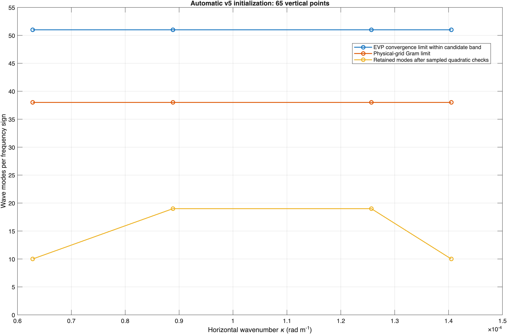

# Automatic resolved-mode selection in v5

The free-surface constructors use one `gramTolerance`, with default `1e-2`. The v5 API is unreleased: the former family-specific and projection tolerance names are removed directly, including constructor options, saved fields, resolution transfer, examples, and tests. There are no aliases or migration paths for those names.

```matlab
N2 = @(z) 1e-4*ones(size(z));
[wvt, assessment] = WVTransformFreeSurfaceBoussinesq.fromStratification( ...
    [1e5 1e5 1000],[8 8 65],N2Function=N2,latitude=30);
assessment.pages(:,["kappa","selectedCount","gridSupportedCount", ...
    "convergedCount","limitingMetric"])
```

Omitting a count selects it automatically. APV and MDA use the same builder and policy as `WVTransformFreeSurfaceQG`, independently of the wave and inertial counts. Each positive horizontal wavenumber has its own wave prefix, shared by the two frequency signs. The inertial prefix is independent. Every configured zero-APV endpoint remains present.

Explicit counts are strict and independently configurable:

```matlab
[wvt, assessment] = WVTransformFreeSurfaceBoussinesq.fromStratification( ...
    [1e5 1e5 1000],[8 8 65],N2Function=N2, ...
    apvModeCount=3,mdaModeCount=2,inertialModeCount=3,waveModeCount=4);
```

A scalar wave count broadcasts to all positive pages. A vector uses `waveModeKappa` keys and must cover the complete supported positive-wavenumber inventory. Explicit zero counts omit waves on those pages. A failed explicit count is rejected rather than silently reduced. Other omitted family counts remain automatic.

## Independent checks

- `gramTolerance=1e-2` bounds fixed-physical-quadrature normalized-Gram error. The resolved bases and prescribed physical pairings are preserved; weights are not fitted.
- `modeConvergenceTolerance=1e-6` checks equivalent depths and physical H1 fields against an independently solved, higher-resolution EVP. References are computed even when the caller requests only the model. Agreement between two resolutions is evidence, not a rigorous absolute error bound.
- `quadraticAliasingTolerance=0.1` controls the existing APV self-product policy and the bounded physical wave-interaction policy. APV/zero-APV cross-products retain their separate qualification.
- `boundaryResolutionTolerance=1e-2` checks each fixed endpoint at every retained positive wavenumber: physical derivatives, endpoint normalization, and coupled physical and signed energy. Reducing other mode counts cannot hide an unresolved endpoint response.

QG's `assessVerticalResolution` brackets a horizontal limit using both its APV/zero-APV cross-product check and the boundary-resolution check. The reported quadratic and boundary errors remain separate; when the boundary sets the limit, there is no limiting APV mode label.

Wave/inertial candidates extend through `Nz-1`. `nEVP` is a starting solve resolution, raised to at least `Nz+4` for automatic candidates. At most three candidate/reference resolution pairs are tried before the automatic policy uses the converged prefix. An explicit `referenceNEVP` fixes the comparison pair. Balanced families retain the existing more conservative EVP sizing rule and independently check its convergence.

## Bounded quadratic policy

The constructor prepares actual resolved fields and independent references once. It chooses up to two closed Fourier interactions for every output wavenumber, including the horizontal mean. It samples low, geometric-interior, and cutoff input modes, keeps every configured endpoint, and measures the existing 13 physical advection channels into wave, inertial, and MDA outputs. APV self-products remain qualified by the provider's separate full-prefix test.

Only the declared candidate count levels are projected and tried. A failed complete map triggers deterministic reductions of the wave input/output pages or inertial output implicated by its worst sampled interaction. Each trial reuses the same measured products and performs no new eigensolve or product evaluation. The result is conservative; it is not a maximal independently selectable count at each wavenumber.

Missing interaction coverage, an unmeasured output prefix, or an unqualified reference cannot accept a map. A page is classified as structurally zero only after verifying that the retained nonzero Fourier vectors cannot form an input pair for that output. This statement excludes mean-input interactions, which are outside this sampled policy.

The policy is not an exhaustive quadratic-aliasing test, a bound on coherent superpositions, or qualification of a full nonlinear Boussinesq RHS. Inertial/MDA input interactions, Boussinesq APV and boundary outputs, and mean vertical-velocity output are outside its coverage. The separate QG assembled-flux experiment remains available in `tools/aliasing-study/runQGQuadraticAssessmentStudy.m`.

Preparation admits at most 500,000 sampled scalar products and 128 count-map trials. Reference-field storage and additional product workspace each have a 512 MiB estimate limit; these estimates exclude the stored model operators and provider solver internals. Output pages are streamed during measurement. Requests exceeding an assessment budget fail explicitly before product evaluation. Large horizontal grids still require a construction-cost trial; these limits do not establish production-grid throughput.

## Inspection and reproducibility

`assessment.pages` separates the candidate ceiling, linear convergence limit, Gram limit, and final count. An automatic request has `requestedCount=NaN`; `selectedCount` is the number actually stored in the model. `candidateLimitReached` never implies that all possible modes were tested. `assessment.apv`, `.mda`, `.inertial`, `.boundary`, `.quadratic`, and `.cost` expose family evidence, coverage, trial history, and timing.

Both models expose `constructionAssessment` after scientific construction. The selected counts, operators, Gram errors, and tolerances are persisted as canonical scientific state. The full construction report is transient and empty after canonical restore; save it separately when retaining the detailed qualification provenance. Restore does not solve modes or rerun selection.

Run `DeveloperExperiments/freeSurfaceModeSelectionExample.m` from the authoring checkout for a figure and optional CSV/MAT output. It uses the same constructor and report as ordinary initialization. The numerical product helpers live in `+WVInternal`; existing authoring study scripts call those shared implementations.

## Example result and verification ledger



For the constant-stratification example above, the 65-point grid selects 27 APV modes, 39 MDA modes, 38 inertial modes, and wave counts `[10 19 19 10]` per frequency sign. The independently converged candidate prefix is 51 and the physical-grid Gram limit is 38 at each wavenumber. The nonuniform final curve comes from the coupled sampled interaction check; it is not a curve of independent per-wavenumber maxima. A separate provider example retains the earlier case with wavenumber-dependent linear accuracy limits.

The recorded local run took 7.42 seconds, including 20 wave/inertial eigenproblems and 12 complete-map trials. The final map reassessment took 0.006 seconds with no new eigensolve or product evaluation. Its additional product-workspace estimate was 217 MiB and its retained evidence was about 20.5 MiB. These are small-domain construction measurements, not a production-grid performance guarantee. The [measurement record](AutomaticModeSelection/summary.json), [wave counts](AutomaticModeSelection/wave-counts.csv), [family counts](AutomaticModeSelection/family-counts.csv), and [PDF figure](AutomaticModeSelection/mode-counts.pdf) accompany the reusable example.

The [focused verification ledger](AutomaticModeSelection/verification.csv) contains 159 passing tests on MATLAB R2025b Update 4 / Apple Silicon with InternalModes 2.0.0-beta.4. It consolidates the latest successful result for each test, including targeted retests after corrections. Coverage includes shared balanced defaults, strict counts, per-kappa and zero-wave maps, fixed endpoint rejection, independent references, one/two-output equivalence, reconstruction and linear evolution, NetCDF restore and resolution transfer, and the existing quadratic-reference controls. An additional runtime-path construction excludes the authoring assessment tools. This is not a fresh exported-package installation or the complete beta scientific suite.

Documentation generation/check has zero drift. Code Analyzer was run on changed MATLAB sources; new numerical helpers have no findings, while existing moved-code style suggestions and legacy test property-name warnings remain. Whitespace and package-manifest scope checks pass. No dependency, release metadata, or versioned package payload changed. The complete-map result must always be interpreted together with its finite coverage.
