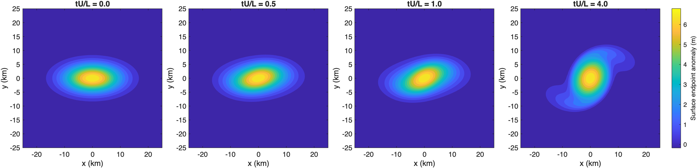

# Deforming zero-APV boundary vortex

The initially elliptical surface anomaly rotates and develops curved extensions. All panels use the same coordinates and color scale. The plotted quantity is the displacement-like endpoint anomaly in meters, rather than buoyancy in acceleration units. The surface is active and the bottom inactive; interior PV remains identically zero.

Parameters: 80 km square domain, depth 1000 m, constant `N2=1e-4 s^-2`, latitude 30 degrees, major radius 10 km and minor radius 5 km. The periodically summed Gaussian has its mean removed. Its amplitude is chosen so the reconstructed grid maximum speed is `0.05*f*10 km`, giving a characteristic time `L/U`. The retained grid is `[128 128 65]`, with four APV and two MDA modes; their coefficients remain zero. The run has nonlinear advection only, `g0=-0.1 m s^-2`, `gd=Inf`, and uses ode78 with energy absolute scale `1e-8` and relative tolerance `1e-8`.

The fourth time is extended from two to four characteristic times to expose deformation. Comparing all displayed times gives:

| Check | Maximum relative field error |
| --- | ---: |
| Tighten both time tolerances to `1e-10` | `1.00e-9` |
| Double horizontal sampling to 256, with 129 vertical points | `7.86e-4` |
| Increase vertical sampling alone to 129 | `4.81e-12` |

The finer horizontal grid requires 129 vertical samples to resolve its boundary response; the 65-point construction correctly rejects that bandwidth. This combined comparison is separated from vertical sampling error by the third row. Fields are compared at coincident horizontal grid points, including the independently recomputed speed normalization. The initial 64-point trial differed by about 1.8% and was not used for the final figure.

The maximum boundary-variance drift is `3.48e-13`; maximum interior PV and the stationary single-mode relative tendency are zero. These support the controls but do not replace the field-refinement comparisons. MATLAB R2026a used the WVM v5 authoring branch and InternalModes beta.4 (`f2ce3c1`).

Run `runBoundaryVortex` from `Documentation/Examples` to reproduce the figure. Run `checkBoundaryVortex(outputFolder)` from `tools/tolerance-study` for the refinement checks. The [PDF](boundary-vortex.pdf) and [compact verification data](verification.csv) accompany this figure. Raw qualification trajectories were written to `/tmp/wv-tolerances`; regenerate them with the supplied drivers if that temporary directory is unavailable.
