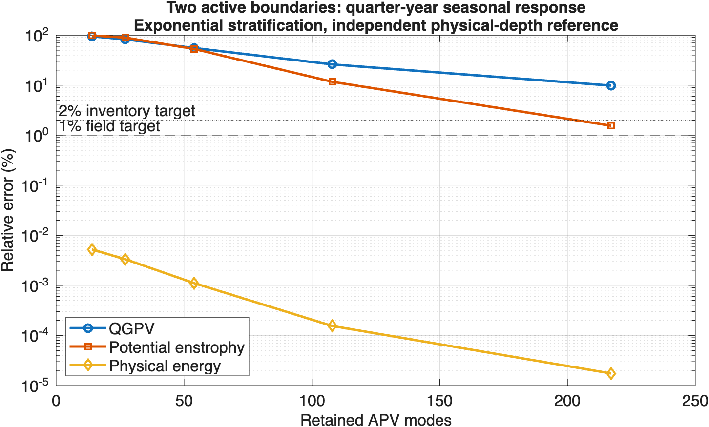

# Two-active-boundary buoyancy-diffusion qualification (#351)

The independent tests support the implemented weak diffusion operator and strict endpoint-displacement forcing. They do **not** yet qualify the seasonal experiment: the retained APV bandwidth can leave large errors in QGPV and potential enstrophy while physical energy appears accurate. Keep #351 open and retain the current experiment pins and saved trajectories as the baseline.

## Physical contract and independent reference

The reference uses the workspace mathematics in `literature/ape-apv-free-surface/notes/gpt-closed-free-surface-qg.tex` and `notes/gpt-free-surface-qg-space-time-diffusion-modes.tex`. The older active-surface/inactive-bottom defaults in some notes are historical; this comparison explicitly sets both finite endpoint parameters to the negative/positive stratification integral.

At one nonzero horizontal wavenumber, write the streamfunction as a linear combination of Legendre polynomials in **physical depth**. Compute their first and second derivatives by differentiated polynomial recurrences and integrate with independently constructed Gauss quadrature. No WVM or InternalModes modal arrays, mapped derivatives, or physical-metric helpers enter construction of the reference operator.

The reconstructed fields are

$$\eta=-\frac{f}{N^2}\varphi_z,\qquad \zeta=\frac{f}{g}\varphi(0),\qquad \mathfrak b=-N^2\left[\eta-\left(1+\frac zD\right)\zeta\right],\qquad q=-k_h^2\varphi-f\eta_z.$$

Integration by parts in the QG inversion gives the positive physical-energy bilinear form

$$M(v,\varphi)=\int_{-D}^{0}\left(k_h^2v\varphi+\frac{f^2}{N^2}v_z\varphi_z\right)\,dz+\frac{f^2}{g}v(0)\varphi(0).$$

For insulated buoyancy diffusion at both active endpoints,

$$M(v,\dot\varphi)=\int_{-D}^{0}\kappa\,\eta_z[v]\,\mathfrak b_z[\varphi]\,dz.$$

A strict surface-displacement source adds $-f v(0)S_0$; a strict bottom source adds $+f v(-D)S_d$. A physical inward buoyancy flux instead adds $-\eta[v](0)Q_0-\eta[v](-D)Q_d$. These are distinct source contracts. Manufactured quadratic buoyancy profiles check both flux signs against the strong thermal tendency.

QR rescales the reference polynomial coordinates using physical energy. From-rest seasonal responses use an augmented matrix exponential with a sine/cosine oscillator, eliminating a time-step error. This reference includes the QG balance projection; a scalar heat solution alone would not test the nonzero-wavenumber model.

WVM fields are independently evaluated by interpolating its stored streamfunction at the **actual physical grid points**, using the known analytic WKB map for the two stratification profiles, then differentiating that polynomial analytically. Using idealized mapped nodes instead of the actual stored points introduced a spurious approximately $10^{-4}$ relative PV cancellation residual in an early diagnostic; correcting the reference interpolation removed that artifact without changing production code or the acceptance tolerance.

## Parameters and targets

- Depth 4,000 m; $N^2=(5.2\times10^{-3})^2\exp(2z/B)$ with $B=\infty$ or 1,300 m; latitude 24 degrees; $g=9.81$ m/s².
- $k_h=2\pi/(100\,\mathrm{km})$, equal to meridional mode 5 in the experiment's 500 km domain. A 4-by-4 horizontal tile isolates this mode without nonlinear products, drag, damping, beta, or a seed.
- Constant buoyancy diffusivity $10^{-5}$ m²/s; period 365.25 days; a unit sine endpoint-displacement source, starting from zero APV, zero endpoint anomalies, and zero MDA at time zero. Relative errors are independent of forcing amplitude.
- Annual diffusion length $\sqrt{2\kappa/\omega}$ is about 10 m. Exact time propagation does not add the vertical bandwidth needed to represent it.
- Targets declared before inspecting the seasonal results: reference refinement below 0.1% in fields and 0.2% in inventories; WVM field/SSH/endpoint-pair errors below 1%, energy/enstrophy below 2%, and directional budget errors below 5%. The no-diffusion PV cancellation target is $10^{-6}$ relative to the constituent inversion terms. MDA column-buoyancy drift must be below $10^{-8}$ and resolved heat-solution field error below 1%.

Field errors use physical-depth weighted L2 norms; endpoint error is the Euclidean norm of the surface/bottom pair. Inventory and instantaneous budget errors are relative to their reference values. Near a small reference inventory or budget, inspect the absolute physical values before interpreting a relative spike. The study does not silently rescale profiles or change targets after seeing a failure.

## Results

Increasing the physical-depth reference from 129 to 193 polynomials changes quarter-year QGPV by $5.7\times10^{-7}$ relative for constant stratification and $1.5\times10^{-6}$ for exponential stratification. Increasing 193 to 257 changes these by $6.4\times10^{-11}$ and $2.1\times10^{-10}$ respectively. Reference errors are far smaller than the model discrepancies.

For exponential stratification at one quarter year:

| Physical nodes | APV modes | QGPV error | Potential-enstrophy error | Physical-energy error |
| ---: | ---: | ---: | ---: | ---: |
| 33 | 14 | 94.46% | 98.34% | 0.00522% |
| 65 | 27 | 82.39% | 89.39% | 0.00334% |
| 129 | 54 | 55.28% | 52.90% | 0.00111% |
| 257 | 108 | 26.01% | 11.69% | 0.000155% |
| 513 | 217 | 9.82% | 1.55% | 0.0000174% |

The additional 257-node exponential case has 11.20% QGPV error and 1.57% buoyancy error at one year, so it also fails the field targets.

At one year, the 129-node exponential case still has 32.77% QGPV error, 3.82% enstrophy error, 6.45% buoyancy error, and 6.86% endpoint-pair error. None of the 24 combinations of the two stratifications, 33/65/129 nodes, and quarter-year sampling through year one passes all targets. Accurate energy at an earlier seasonal phase therefore does not establish field or budget accuracy.

The experiment's default **513-node** exponential configuration retains 217 APV modes. Its QGPV errors at years 0.25, 0.5, 0.75, and 1 are **9.82%, 3.43%, 1.77%, and 3.48%**. All exceed the 1% field target. Its other measured errors pass their predefined targets at those four times: quarter-year enstrophy error is 1.55%, buoyancy error is 0.0163%, and endpoint-pair error is 0.0195%. This distinction matters: the default is substantially more accurate than the reduced cases, and the remaining measured failure is the QGPV field, not a blanket failure of all physical observables.



Raw tables: [seasonal 33/65/129-node cases](issue-351-seasonal.csv), [257-node exponential cases](issue-351-high-resolution.csv), [default 513-node exponential cases](issue-351-default-resolution.csv), [fixed APV bandwidth](issue-351-fixed-bandwidth.csv), and [fixed physical grid](issue-351-fixed-grid.csv).

### Separating spatial errors

At a **fixed 14-mode APV bandwidth**, increasing the grid from 33 to 65 to 129 nodes leaves the exponential quarter-year QGPV error at 94.46%. At a **fixed 129-node grid**, increasing APV bandwidth from 14 to 27 to 54 lowers the QGPV error from 94.46% to 82.39% to 55.28%. All these cases retain both zero-APV endpoint coordinates. Reduced operators are reassembled in their retained subspace, rather than truncating a full coefficient generator by deleting rows and columns.

Independent 257/513-point physical-depth quadratures agree within the $10^{-6}$ operator target. Independently differentiating the stored streamfunction and assembling the weak operator agrees with the production generator within the $10^{-4}$ relative target. At 65 and 129 nodes the seasonal streamfunction-derived PV agrees closely with the separately represented PV; their discrepancy is much smaller than the seasonal reference error. These controls identify missing retained bandwidth as the dominant error in the measured cases. They do not claim that every future stratification map is qualified.

### Mean-density diffusion

The separate MDA test starts with physical buoyancy $10^{-6}[1+0.2\cos(\pi(z+D)/D)]$ and compares against the analytic insulated-column heat solution at $\kappa t\pi^2/D^2=0.2$. It includes a nonzero mean and a decaying cosine, and reconstructs buoyancy from the MDA displacement directly, avoiding the known public-field omissions tracked in #348.

At 129 nodes the relative evolved buoyancy error is approximately $8.9\times10^{-7}$ for constant stratification and $1.6\times10^{-3}$ for exponential stratification. Both improve on 65 nodes and satisfy the 1% field target. Column buoyancy is conserved within $10^{-8}$. The initial projection error is measured separately; constant buoyancy is not assumed to lie exactly in every truncated variable-stratification MDA space.

## Reproduction

Use the WVM authoring checkout and its compatible InternalModes dependency, add `UnitTests` to the MATLAB path, and run:

```matlab
results = runtests('UnitTests/TestFreeSurfaceQGDiffusionQualification.m');
assertSuccess(results);
seasonal = TestFreeSurfaceQGDiffusionQualification.runStudy;
fixedBandwidth = TestFreeSurfaceQGDiffusionQualification.runStudy(maximumAPVCount=14,timeFractions=.25);
fixedGrid = TestFreeSurfaceQGDiffusionQualification.runStudy(gridCounts=129,maximumAPVCount=27,timeFractions=.25);
defaultResolution = TestFreeSurfaceQGDiffusionQualification.runStudy(gridCounts=513,scales=1300);
```

To redraw the figure from the recorded CSV tables, add `Documentation/Validation` to the MATLAB path and call `plotIssue351SeasonalErrors`.

The five formal tests verify the independent reference, strict forcing, weak assembly/quadrature, inward-flux signs, and MDA heat solution. `runStudy` returns every measured error and an explicit `passed` flag; a failed seasonal target remains visible instead of being converted into a passing unit test.

Baseline: WVM `ac39308e5f044696cf8142d5e9b9cd80c7f9591c`; InternalModes `9e2edb3eda96191078e22f5d3a8bc785be38143d`; MATLAB R2025b Update 4. Other isolated runtime revisions: ClassAnnotations `ca212699516e30792bd3e584b7842289c49ca772`, NetCDF `17d00778fdc79284723139f57d3a88fef53f2247`, SplineCore `0ce6950e6328e931fe91797dfd707c24ceac8f6f`, Chebfun `1fe01297a74d9ee765a466c3068b7fb474bee053`, Distributions `cc0e9fa337de5e308978049c798d5fb6069e05a6`. ClassDocumentation 1.3.2 is an authoring-only dependency.

## Verification

All five new qualification tests and all 22 existing diffusion/integrator regression tests passed: **27 distinct tests**. The existing suites cover ordinary/exponential seasonal agreement, restart, and configuration changes. Code Analyzer reports zero findings in the new test source. `docs:check` passed with 2,352 files, 4,807 routes, and no generated differences. No production source, runtime manifest, package snapshot, or experiment output changed. Full/exhaustive and released-package suites were not run for this test-and-report change.

## Next steps and limits

Keep the canonical APV/zero-APV/MDA implementation as the comparison baseline and preserve the shared WKB grid, forcing interfaces, and common ordinary/exponential generator. There is no demonstrated operator sign defect here that justifies replacing those interfaces.

Keep the seasonal qualification gate open. Establish a practical retained-bandwidth/resolution combination that meets the field and budget targets at the experiment's parameters, improving on the measured QGPV error at the actual default 513-node configuration. If that is too costly, use this independent reference to evaluate a deliberately designed thermal-state extension; exact-time diagonalization of the existing truncated state alone cannot supply the missing structure. This decision belongs ahead of #353's nonlinear promotion.

A bounded candidate prototype is to represent the interior QGPV directly on the shared WKB-Chebyshev grid, with the same two prognostic endpoint anomalies, and perform the balanced inversion without first truncating through the APV family. Compare that linear prototype with this reference before changing WVModel or the forcing interfaces. APV/MDA coordinates can remain useful projections and diagnostics, but adding overlapping thermal coefficients without a precise state partition would not solve the representation problem. The present results motivate testing this alternative; they do not yet qualify it.

Complete #348's public MDA QGPV/endpoint reconstruction before relying on public diagnostics for nonzero-mean experiments. Independently varying numerical map-construction resolution, fully qualifying separate endpoint-relative errors, broader time/parameter coverage, and variable diffusivity remain outstanding. This work does not rerun or invalidate saved nonlinear experiments, alter dependency pins, qualify inactive-endpoint diffusion, or establish released-package installability.
