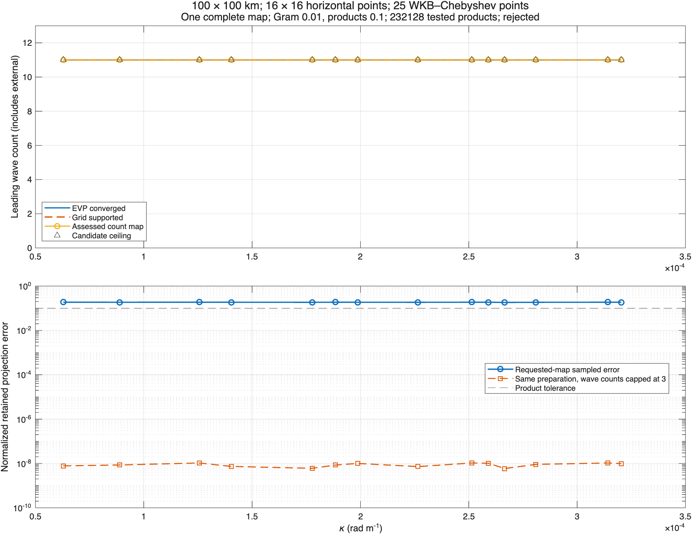

# Explicit count-map quadratic assessment

## Performance contract established before expansion

The initial Apple Silicon / MATLAB R2025b timing trial used the unchanged beta.4 advisory on `cal-constant-17` and `cal-exponential-17`: eight candidate waves, independent three-mode APV/MDA/inertial families, both boundaries, an 8 by 8 horizontal grid and 17 vertical points. The [baseline measurements](baseline-costs.csv) record approximately 2.3–3.2 seconds of mode/reference preparation, 4–5 seconds for the first advisory, and 3.5–4.3 seconds for another common-prefix request. Each request repeats 79,968 reserved products and retains about 9.7 MB of evidence.

Before expanding the inventory, the implementation targets are: at most 10 seconds for complete preparation on these calibration cases, at most 0.25 seconds for a repeated count-map assessment, and at most 64 MiB of retained evidence. The bounded companion example targets at most 60 seconds of preparation, 0.5 seconds per repeat assessment, and 128 MiB retained evidence. These are local benchmark targets, not cross-hardware API guarantees. A default 500,000-product reservation and explicit working-memory estimate protect larger preparations; exceeding a budget fails before source products are evaluated.

The intended reuse boundary is an explicit evidence snapshot: preparation computes qualified product errors for a declared candidate band and interaction inventory; later assessments receive that snapshot alone and select the actual input/output prefixes. A changed grid, basis, reference, normalization or inventory requires a new preparation. There is no keyed global cache, retained provider object in WVM state, or implicit assessment during ordinary construction/restart.

## Measured result

Three unprofiled repetitions on an Apple M4 Max / MATLAB R2025b Update 4 give median complete preparation of **5.83 seconds** for the constant profile and **4.79 seconds** for the exponential profile. The corresponding median repeat-map assessments take **9.66 ms** and **4.74 ms**, respectively, with about **10.8 MiB** of retained evidence. These preparations include the explicit output-page coverage additions (85,272 reserved products, versus the historical 79,968). The largest individual product batch is 232; the conservative workspace estimate is about 195 MiB. All recorded preparation/reuse/retention targets pass.

The [cost ledger](benchmark/costs.csv) separates candidate/reference solve calls and times, other grid/evaluation work, physical projection preparation, product evaluation and repeat reporting. The call counts refer to explicit solver calls, including one bulk boundary-response call per resolution, not an inferred number of internal matrix factorizations. The [environment record](benchmark/environment.json) identifies the host. The [repeat profiler function counts](repeat-function-counts.csv) independently show no EVP solve, source polarization, product-projection preparation or product evaluation during the repeat call.

The performance contract is for these bounded study configurations. The inherited source-study preparation still constructs its horizontal interaction inventory and modes before product reservation; this is not a demonstrated production-grid timing bound. The new budget checks bound the subsequent product preparation. Large inventories require a separate sizing trial rather than extrapolating these timings.

## Qualified figure



The [PDF](example/count-map-quadratic.pdf), [linear counts](example/linear-counts.csv), [quadratic pages](example/quadratic-pages.csv), [second-map pages](example/repeat-pages.csv), [limiting interactions](example/limiting-interactions.json), [physical grid](example/physical-grid.csv) and [provenance](example/provenance.json) are committed. This control uses a 100 km square, 1000 m depth, 16² horizontal grid and 25 WKB-Chebyshev samples, with N²=10⁻⁴ exp(2z/400) s⁻², f=10⁻⁴ s⁻¹ and g=9.81 m s⁻². The mode/reference orders are 192/256 and the reference quadratures have 257/513 points. Independent APV/MDA/inertial counts are three; both boundaries remain active inputs.

All 11 tested candidates pass mode convergence and the chosen 1% Gram test. The candidate ceiling is shown; this is not a measured maximum possible mode count. Their sampled quadratic errors are approximately 0.18–0.19 at positive output kappa, exceeding the unchanged 0.1 product tolerance. Capping wave counts at three passes the same sampled checks with the same preparation; its positive-page errors are about 10⁻⁸. The zero-kappa mean-output evidence is retained in the CSV reports, separately from the plotted positive wave pages. The 1% Gram threshold is an example choice, not a change to WVM's stricter default or a model-accuracy guarantee.

The complete example preparation takes **15.86 seconds**, retains about **32 MiB**, and its second map takes **13.3 ms**. Eleven candidates were selected to keep the conservative workspace reservation below 512 MiB. This WVM companion uses its dealiased, Nyquist-excluding horizontal interaction inventory; it is not the full FFT inventory of the original InternalModes linear-only figure. A count-map report applies to that complete coupled map; errors from different maps cannot be combined into a freely selectable nonlinear count curve.

## Sparse versus dense control

The [6² dense control](benchmark/dense-control.csv) includes retained nonzero wave outputs as well as means. The earlier 4² exploratory control was rejected as insufficient because its dealiased inventory only exercised mean outputs. Constant and variable profiles were compared for every common count 1–8. Sparse and dense acceptance decisions agree in all 16 comparisons. Their largest global/per-page error discrepancy is **1.163×10⁻⁶**, below the declared 10⁻⁴ reference allowance and far below the 0.1 product threshold. The discrepancy is recorded rather than asserted to be zero. At count eight the sparse selection evaluates 59,976 products versus 388,800 for the dense control. This is bounded calibration of the selection; it is not an exhaustive or arbitrary-superposition guarantee.

## Short-wave reference limitation

The [1 km control](short-wave-control/count-map-quadratic.png) and its [provenance](short-wave-control/provenance.json) retain the same vertical parameters and sampling count. Modes pass the declared two-resolution checks (maximum required discrepancy about 5.8×10⁻⁹), but the product reference comparisons fail: quadrature-reference discrepancy about 0.150 and independent-EVP product discrepancy about 10.72, against the unchanged 10⁻⁴ allowance. Both count maps are therefore **reference-inconclusive**. The plotted product-error estimates are unqualified, not accepted accuracy evidence.

This does not establish that the count-map selection is wrong, nor that the short-wave physical modes are wrong. It establishes that the existing product-reference gate is insufficiently satisfied for this configuration; locating the responsible products and resolving their numerical/reference behavior is separate scientific work. No threshold was weakened. That control takes about 18 seconds to prepare and 19 ms to reassess. The primary qualified example uses the longer-wave configuration deliberately, with both outcomes preserved.

## Reproduction and verification

From this authoring checkout, configure the released dependency path and study tools as documented in the study README, then run:

```matlab
benchmarkWaveQuadraticAssessment("new-benchmark-directory");
waveQuadraticResolutionExample("new-figure-directory");
```

For the short-wave control, supply the exact `configuration` in its provenance JSON; the function accepts `configuration=config`. Every writer refuses an existing output directory. Reproduce the main figure from source `9a2101d2`, and the strengthened benchmark/short-wave control from `e30e24cd`; the [combined provenance](provenance.json) records full revisions, provider beta.4 and the immutable OceanKit snapshot. Both commits remain in the review branch history. Source and figure defaults were committed before generating their artifacts.

The [test ledger](tests.csv) records **28/28 passing affected tests**, including all 18 established source/product/advisory checks and ten count-map tests. The strengthened 6² dense method was rerun after changing that control; the ledger contains its final result. The example's existing-directory guard was checked separately after correcting an error-function shadowing variable, and both final PNG/PDF outputs were generated successfully and the PNG layouts inspected. Documentation check passes with 2,358 files, 4,819 routes and zero drift. New MATLAB files are Analyzer-clean; existing source files retain three unrelated `find` performance suggestions. Later edits only change the dense-control grid literal, formatting or recorded documentation/artifacts.

The package manifest, runtime model, provider code, historical calibration files and beta.3/beta.4 advisory references are unchanged. No new installed-provider qualification is needed for an authoring-only change against the already qualified beta.4 dependency. No model-instance assessment or persistence format is added. APV/boundary outputs, boundary-sheet dynamics and the corresponding family-specific qualification remain separate under #426.
