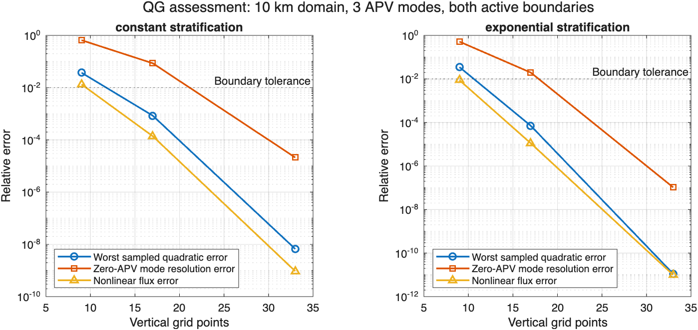

# Issue 426 evidence

Generated from WVM source `3063e69e821544a58143e4851b8dc67287f0e119`, with the pinned exported InternalModes 2.0.0-beta.4 graph. The [operator and API specification](../Issue426QGQuadraticAssessment.md) defines the norms and limits. Reproduce with `runQGQuadraticAssessmentStudy(newOutputDirectory)` after `configureStudyPath`.

The legend distinguishes the worst sampled quadratic error, the zero-APV mode resolution error, and the nonlinear flux error. The nonlinear flux curve compares the complete instantaneous tendency of the chosen example flow with an independent reference in the physical energy norm. The three curves use distinct error measures; the dashed 1% tolerance applies to zero-APV mode resolution. Legend wording was updated from the recorded CSV data without rerunning or changing the scientific measurements.

## Scientific results

For the 10 km domain, three retained APV modes, both endpoints, and fixed physical parameters:

| Stratification | Vertical points | Largest sampled product error | Fixed-boundary error | Assembled tendency error | Advisory status |
| --- | ---: | ---: | ---: | ---: | --- |
| Constant | 9 | 3.72e-2 | 6.56e-1 | 1.33e-2 | Rejected |
| Constant | 17 | 8.45e-4 | 8.56e-2 | 1.38e-4 | Rejected |
| Constant | 33 | 6.67e-9 | 2.12e-5 | 9.40e-10 | Assessed |
| Exponential | 9 | 3.48e-2 | 5.15e-1 | 8.72e-3 | Rejected |
| Exponential | 17 | 7.10e-5 | 1.96e-2 | 1.11e-5 | Rejected |
| Exponential | 33 | 1.11e-11 | 1.04e-7 | 9.91e-12 | Assessed |

The product tolerance is 0.1; the independent fixed-boundary tolerance is 0.01. The coarse examples demonstrate why product acceptance alone is insufficient. Their limiting boundary errors come from physical derivatives/zero-APV balance on the grid. Increasing Nz fixes them without discarding either endpoint. These are example-specific results, not a universal 33-point recommendation.

The actual model's endpoint tendencies agree with the direct refined convolution to approximately 1e-11 relative accuracy even in the coarse cases. Thus endpoint values alone do not establish adequate vertical boundary representation. At the finest grid, the complete resolved tendency agrees in the physical energy norm to approximately 1e-9 (constant) and 1e-11 (exponential).

All six source-reference comparisons qualify. Ninety-six scalar endpoint measurements per case require the declared absolute allowance because of tiny opposite-endpoint velocities; the raw relative discrepancies remain in the product CSV. The maximum mixed reference budget fraction is 0.06165. Deliberate material reference changes reject, and disabling the absolute allowance makes the short-overlap control reference-inconclusive.

The 6² dense calibration measures 9,000 scalar outputs against 2,250 in the fixed selection. All four underresolved/resolved controls agree on both status and the largest sampled error. This is a bounded calibration, not exhaustive evidence for larger inventories. `resolved-coverage.json` lists the selected interactions; `interaction-inventory.csv` resolves every integer vector and page key in `resolved-products.csv`.

The separate 100 km manufactured-state controls include mixed, APV-only, surface-only, bottom-only, and collinear states, all with a maximum velocity of 0.03 m/s. Their nonzero energy-norm tendency errors range from 3.8e-13 to 3.7e-9; the collinear tendency and every horizontal mean source vanish exactly. Rescaling velocity by ten rescales the tendency norm by one hundred. The assembled mixed norm is about 12% of the sum of its individual term norms, so the control includes cancellation.

PV enstrophy work and endpoint-variance work vanish to roundoff when measured against their physical term bounds. The APV-only endpoint tendency is analytically zero: its raw assembled-source-relative work fraction can be about 0.04 while its work over the absolute individual-term bound is 2e-17. Both diagnostics are preserved in `assembled-apv.json`; the latter is the meaningful conservation test for this cancellation. No denominator floor or deletion of small products is used.

## Cost

The 8², 17-point calibration retains 4,500 scalar measurements per profile. Median additional QG preparation is 0.114 s (constant) and 0.095 s (exponential); repeated assessment is 0.57 ms and 0.83 ms. Both snapshots retain about 1.13 MiB with an estimated incremental workspace of 8.01 MiB. Preparation adds zero mode solves. Prior source preparation costs 1.48–1.50 s in this run and is reported separately. The larger wave inventory and prior source-preparation cost are not hidden in the cheap reassessment timing.

All measured costs meet the declared incremental targets: 2 s preparation, 250 ms reassessment, 64 MiB retained evidence, and 512 MiB estimated workspace. The independent assembled-state driver has separate model-construction, RHS and reference timings in each JSON record.

## Verification ledger

- Nine new QG tests passed, including analytical localized exponentials, fixed-boundary failure, explicit budgets, missing coverage, material reference failure, tiny-overlap qualification, amplitude rescaling, collinear zeros and single-excited-endpoint states.
- Fifty-nine existing focused tests passed: wave advisory/projection, QG derivatives and diagnostics, actual single-active-boundary configurations, variable wave counts, persistence and coefficient transfer.
- One initial validation-path test caught a local variable shadowing MATLAB's `error` function; corrected and reran that test. The later conservation-work diagnostic refinement reran only its two affected test methods. `tests.csv` records all nine final passing results.
- MATLAB Code Analyzer: zero findings across all seven new source/test files.
- `docs:check`: 2,358 files, 4,819 routes, zero validation failures and no generated drift. Later authoring-only evidence and explanatory prose do not affect generated website sources.
- Whitespace and scope checks passed; runtime code, package manifest and versioned package snapshots remain unchanged. The PNG was visually checked for readable labels and clipping.

The assessment remains optional authoring tooling. It does not certify wave-coupled nonlinear Boussinesq dynamics, MDA inputs, arbitrary coherent states, trajectories, or automatic mode selection. Both fixed boundaries remain part of every reported QG preparation.
