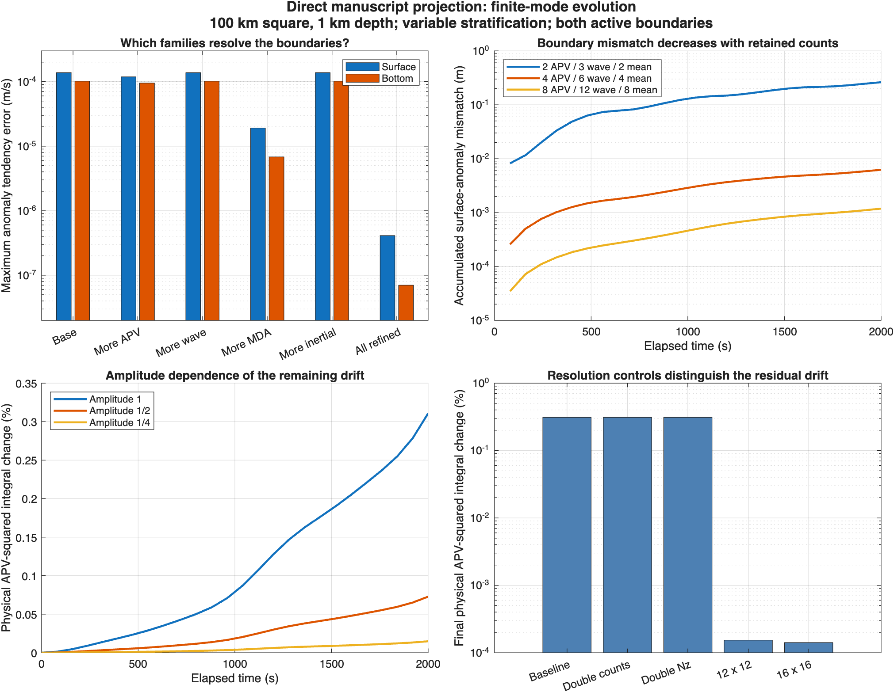

# Direct manuscript evolution: boundary resolution and short trajectories

The direct evaluator studied here is now used by the production nonlinear callback. See [runtime adoption and requalification](direct-runtime-qualification.md); the previously alternative weak runtime has been removed. The measurements below retain their original study grids, padding and timestep definitions.

This completes the bounded investigation proposed after the [first direct-RHS comparison](manuscript-projection-comparison.md). The direct manuscript equation advances short nonlinear trajectories through the existing `WVArrayIntegrator`. Finite boundary errors can be separated by mode family. The largest remaining APV drift on the tiny horizontal grid is primarily horizontal truncation. This supports runtime integration of the declared approximation; it does not establish an all-orders closure, exact finite-dimensional conservation or universal nonlinear count defaults.

The implementation baseline is WVM `e92eaaa6da439d0bf44331b8662e4b2f7857ef1a`, with InternalModes `2.0.0-beta.4` and the existing pinned exports. The authoritative manuscript remains *A unified theory for geostrophic and gravity-wave dynamics of the ocean surface and interior*, [Overleaf](https://www.overleaf.com/project/6317e19111f4547c06f405b1), revision `311ebf56c13c30ab4cac423ef7260d3bd693e939`. The manuscript, production nonlinear RHS, public API, dependencies and released snapshots are unchanged. PR #459 remains draft.



In the first panel, the base counts are 2 APV, 3 waves per sign, 2 MDA and 2 inertial modes. A family-only refinement changes its count to 8, or 12 for waves; “All refined” uses all four larger counts. The two zero-APV boundary modes remain present. “Mean” in the second-panel legend means both MDA and inertial counts. Every displayed run uses exponential stratification. The amplitude trend in the third panel alone cannot distinguish approximation error from truncation; the fourth panel supplies that distinction for the leading observed drift.

## Boundary and source-to-state interpretation

The unforced amplitude equation remains `eq:projected-amplitude-equation`,

$$
\dot A=-\Pi[\mathcal N+\mathcal P].
$$

No pressure recovery, weak mass solve, multiplier, boundary correction or energy adjustment enters this evolution. Pressure is modal pressure in every Appendix C occurrence, including the horizontal tendency inside vertical advection. The upper-constant reference and approximate surface pressure match the first comparison.

Let $C(t)$ reconstruct SSH. The modal phases satisfy $C_tA=\hat w_s$, giving the independently measured kinematic residual

$$
R_\zeta=\partial_t\zeta-\hat w_s=C\dot A.
$$

Define $b_s=\eta_s-\zeta$ and $b_b=\eta_b$. With the physical horizontal velocities evaluated on each boundary, the unforced material residuals are

$$
R_s=\partial_t b_s+\mathbf u_{H,s}\cdot\nabla_H b_s,\qquad R_b=\partial_t b_b+\mathbf u_{H,b}\cdot\nabla_H b_b.
$$

These targets are now evaluated directly, independently of the old weak-stage helpers. Wave and inertial amplitude tendencies have zero boundary anomaly. Only the balanced families and MDA can supply its evolution: MDA supplies the horizontal mean; APV and zero-APV supply nonzero horizontal harmonics. In contrast, SSH involves balanced and wave families, with no MDA or inertial contribution. This explains why adding waves cannot fix a truncated mean-density boundary tendency.

The four-field source projector is not a general state inverse. The manuscript time operator in `eq:linear-and-nonlinear-operators` has no pressure time derivative, whereas the generalized pairing includes the pressure-derived SSH trace. If $J$ removes that fifth component and $R(t)$ reconstructs the state, then, to quadrature accuracy,

$$
\Pi J R b=b-B Cb,
$$

where $B$ is the generalized-energy coefficient functional of the omitted SSH/pressure trace. This is a diagnostic identity, not an additional system being solved. A new control cancels only $Cb$ using an external-wave state and verifies that projecting the remaining four reconstructed fields recovers their bulk fields. The direct finite-inventory RHS therefore has a source-to-state consistency residual associated with $C\dot A$; it must be measured, rather than hidden by treating source projection as a state inverse. The complete linear residual still cancels as established by the earlier independent tests.

For the wave fixture, the initial boundary anomalies are spatially constant. Direct Appendix C displacement sources have zero endpoint values, as required by material advection, but a short MDA expansion of their nonzero interior horizontal mean has nonzero endpoint traces. Increasing MDA resolution reduces these traces. This identifies a concrete truncation mechanism without changing the projection metric.

## Independent family refinement

The [42-state table](manuscript-boundary-counts.csv) covers constant and exponential stratification, three interaction fixtures and seven family inventories, all on 8² by 129 samples. All requested modes pass the existing construction convergence, Gram and sampled quadratic checks. [Per-family contributions](manuscript-boundary-families.csv) are recorded separately.

The following exponential mixed-state values separate the surface residual into its horizontal mean and its nonmean part. The entries are absolute maximum tendencies in m/s, except that the mean column is the absolute horizontal mean.

| Refinement | Surface mean error | Surface nonmean error | SSH error |
| --- | ---: | ---: | ---: |
| Base: APV/wave/MDA/inertial = 2/3/2/2 | 1.184e-4 | 1.914e-5 | 9.360e-8 |
| APV only: 8/3/2/2 | 1.184e-4 | 3.732e-7 | 6.969e-9 |
| Waves only: 2/12/2/2 | 1.184e-4 | 1.914e-5 | 9.956e-8 |
| MDA only: 2/3/8/2 | 4.005e-8 | 1.914e-5 | 9.360e-8 |
| Inertial only: 2/3/2/8 | 1.184e-4 | 1.914e-5 | 9.360e-8 |
| All: 8/12/8/8 | 4.005e-8 | 3.732e-7 | 1.940e-9 |

The bottom shows the same division into mean and nonmean errors. Waves contribute to cancellation of the SSH tendency; increasing them alone need not monotonically reduce that residual when the balanced expansion stays short. No additional thermal modes are introduced.

## Trajectories and physical error scales

The [summary](manuscript-evolution-summary.csv) contains 24 completed trajectories; [histories](manuscript-evolution-history.csv) contain accepted-step observations. The principal case uses a 100 km square, 1 km depth, $N^2=10^{-4}\exp(\xi/650)$, both active boundaries, clocks $t_0=-17$ and initial $t=327$ s. The mixed seed includes both wave signs, an external/internal wave combination, APV, zero-APV, inertial and MDA content. Wave-only interaction cases still include the explicitly prescribed mean-density offsets needed to keep parcel labels inside the reference domain; they are not zero-background-density wave solutions.

All trajectories last 2,000 s. In the principal fixture this is 1.98 periods of the fastest initially excited wave, 0.050 periods of the slowest excited wave, and 0.0185 of $L_x/U_{\max}$. This is a short nonlinear test, not a long internal-wave or advective-time qualification. No stage left the parcel-label domain, either on the product grid or on the independent common checkpoint grid.

Each mismatch integral is $\int_0^T\|R(t)\|_\infty\,dt$, accumulated with the RK4 stage weights. It measures accumulated inconsistency in a boundary equation, not the total solution error. At 10 s steps on the 8² horizontal grid:

| APV/wave/MDA/inertial counts | SSH mismatch | Surface-anomaly mismatch | Bottom-anomaly mismatch |
| --- | ---: | ---: | ---: |
| 2/3/2/2 | 0.203 mm | 262 mm | 200 mm |
| 4/6/4/4 | 0.0254 mm | 6.22 mm | 1.80 mm |
| 8/12/8/8 | 0.00322 mm | 1.18 mm | 0.225 mm |
| 16/24/16/16 | 0.000404 mm | 0.624 mm | 0.0837 mm |

The initial surface and bottom anomaly means are +2 and -2 m, providing label-domain support. Their spatially varying RMS amplitudes are only 0.1414 and 0.07071 m. The summary reports both total and varying scales; using the mean support alone would make relative accuracy look artificially favorable. Cases with no initial boundary variation retain absolute errors and have NaN relative-variation metrics.

Independent barycentric evaluation uses the analytically known WKB maps on a fixed 16² by 101 physical-reference checkpoint grid. Cross-run initial fields agree to at worst $4.36\times10^{-15}$ in the scaled checkpoint norm. This closes the seed-consistency gap in the first comparison. The norm uses hatted velocities, a fixed $10^{-2}$ s$^{-1}$ displacement scale and SSH scaled by $\sqrt{g/D}$; it is a comparison norm, not nonlinear physical energy.

The principal mixed case has a successive time-step difference ratio 15.7 for 40/20/10 s, consistent with fourth-order integration where time error dominates. The 20 versus 10 s final-field difference is $1.85\times10^{-9}$ relative. For constant-stratification waves the smaller-step ratio is 12.5, rather than a clean 16; the 80 and 40 s errors against the 10 s reference have ratio 17.3, consistent with a larger-error fourth-order trend. The physical-height reference transition and small numerical floors preclude claiming uniform fourth-order behavior at every tested step. All recorded differences are retained in the CSVs.

## APV, energy and horizontal truncation

Physical APV is evaluated from `eq:apv-physical-dot-definition`,

$$
q=(\nabla_z\times\mathbf u+f\hat{\mathbf z})\cdot\nabla_z r-f,\qquad r=z-\eta.
$$

The diagnostic is $\int\gamma q^2\,d\xi\,dA$ with horizontal area averaging. It includes the nonlinear physical velocity map and density-label gradient, rather than using the variance of APV modal coefficients.

| Principal mixed control | Relative APV-squared change | Relative physical-energy change |
| --- | ---: | ---: |
| 8², 8/12/8/8 counts, Nz=129 | 3.109e-3 | -1.269e-7 |
| Double retained vertical counts | 3.107e-3 | -1.355e-7 |
| Increase Nz to 257 at fixed counts | 3.109e-3 | -1.269e-7 |
| Double horizontal padding at fixed inventory | 3.109e-3 | -1.269e-7 |
| 12² horizontal retained grid | 1.534e-6 | -1.130e-7 |
| 16² horizontal retained grid | 1.415e-6 | -1.130e-7 |

The leading 8²-grid APV drift is thus primarily missing horizontal harmonics. More product-evaluation points at fixed retained bandwidth do not remove it. The 8²/padding-four and 16²/padding-two controls both evaluate products and diagnostics on 32² points; the latter additionally retains more horizontal harmonics. The 8² versus 16² final-field difference is $8.60\times10^{-4}$ in the checkpoint norm; the 12² versus 16² difference is $2.81\times10^{-6}$. The amplitude controls give relative APV changes $3.109\times10^{-3}$, $7.277\times10^{-4}$ and $1.481\times10^{-4}$ at amplitudes 1, 1/2 and 1/4. That trend alone would have been insufficient to identify a pressure-approximation effect: nonlinear truncation also has amplitude dependence. The remaining roughly 1.5 ppm drift is not assigned wholly to one cause by this bounded study.

On the 16² grid, accumulated surface and bottom mismatch are 0.707 and 0.182 mm: about 0.50% and 0.26% of the initial varying-anomaly RMS scales. The SSH mismatch is 0.00331 mm. These measurements support a useful small-amplitude prototype, without specifying a universal tolerance.

The variable wave-count control uses repeating per-kappa prefixes [12,6,0]. It remains valid and integrates with inactive padding exactly zero, but differs from its otherwise matched uniform-count final state by 0.962% in the checkpoint norm. Correct support for variable counts does not mean every count map gives equivalent nonlinear physics. Counts stay fixed during every run; no diagnostic silently reselects them.

Energy is the manuscript upper-constant-reference kinetic plus APE energy with the matching approximate $g\zeta^2/2$ surface term. Let $R_r$ and $R_q$ be physical material residuals using the actual reconstructed mesh velocity, and $\mathbf e_u$ the Cartesian momentum residual with supplied modal pressure. With horizontal area averages understood, the independently derived accounting identities are

$$
\frac{d}{dt}\int\gamma F(r)\,dV_\xi=\int\gamma F'(r)R_r\,dV_\xi+\int_A R_\zeta F(r_s)\,dA,
$$

$$
\dot E=\int\gamma[\mathbf u\cdot\mathbf e_u-\eta N^2(r)R_r],dV_\xi+\int_A R_\zeta[K_s+\mathrm{APE}_s+g\zeta],dA,
$$

and the first identity also holds for $F(q)$ with $R_q$. These include the boundary flux caused by a mesh/kinematic mismatch. The energy/label/APV derivatives pass independent centered-difference controls; the instantaneous residual-work identities close within $1.77\times10^{-11}$ m³/s³, $1.0\times10^{-12}$ m³/s and $4.1\times10^{-28}$ m/s³ respectively in the family study. At 10 s trajectory steps, maximum energy change minus integrated physical residual work is $6.41\times10^{-9}$ m³/s²; the analogous APV-squared residual is below $1.30\times10^{-20}$ m/s². These are accounting checks, not conservation enforced by the solver. The positive physical energy and the signed projection pairing remain distinct.

## Adoption decision and limits

Proceed to integrate the direct Appendix C RHS through the existing `WVNonlinearAdvection`, family-keyed `coefficientTendency` and `WVModel` lifecycle. Preserve the tested coordinate/displacement/cache/observer work. The existing `WVArrayIntegrator` already advances this RHS without a new hierarchy. No evidence here requires a pressure or constraint solve as a default part of the quadratic manuscript baseline.

Runtime adoption and the subsequent forcing, energy/API, example and native/provider-free restart checks are now recorded in the [direct runtime qualification](direct-runtime-qualification.md). The old weak machinery has been removed. General nonlinear count defaults and longer-time qualification remain separate decisions; linear construction defaults are unchanged.

Complete RHS timings include reconstruction, geometry, derivatives and source projection, after warm-up. The 8² instantaneous examples took about 8–27 ms per call on this host; these are workload-specific observations, not a controlled speedup comparison. Construction and full trajectory/diagnostic times are recorded separately. The 16² model also constructs modes across its larger horizontal wavenumber set; no large-grid cost claim is made.

## Reproduction and verification

Use the pinned `configureCIEnvironment` exports and add `tools/nonlinear-study`. The [operator helper](../../../tools/nonlinear-study/manuscriptEvolutionOperators.m), [family driver](../../../tools/nonlinear-study/runManuscriptBoundaryStudy.m), [trajectory driver](../../../tools/nonlinear-study/runManuscriptTrajectoryStudy.m), [collector](../../../tools/nonlinear-study/collectManuscriptTrajectoryStudies.m) and [plotter](../../../tools/nonlinear-study/plotManuscriptEvolutionStudy.m) are authoring tools, not new public runtime APIs. Run folders should be outside the source checkout because trajectories write local MAT checkpoints used for independent comparisons.

```matlab
runManuscriptBoundaryStudy(fullfile(root,'boundary'));
runManuscriptTrajectoryStudy(fullfile(root,'main'));
runManuscriptTrajectoryStudy(fullfile(root,'waves'),profile="constant",scenario="waves",configurations=3);
runManuscriptTrajectoryStudy(fullfile(root,'wave-balanced'),scenario="waveBalanced",configurations=3,deltaT=10);
runManuscriptTrajectoryStudy(fullfile(root,'ragged'),profile="constant",configurations=3,deltaT=[20 10],shouldUseRaggedWaves=true);
runManuscriptTrajectoryStudy(fullfile(root,'half'),configurations=3,deltaT=10,amplitude=.5);
runManuscriptTrajectoryStudy(fullfile(root,'quarter'),configurations=3,deltaT=10,amplitude=.25);
runManuscriptTrajectoryStudy(fullfile(root,'more-modes'),configurations=4,deltaT=10);
runManuscriptTrajectoryStudy(fullfile(root,'more-samples'),configurations=3,deltaT=10,Nz=257);
runManuscriptTrajectoryStudy(fullfile(root,'horizontal'),configurations=3,deltaT=10,Nxy=16);
runManuscriptTrajectoryStudy(fullfile(root,'horizontal-middle'),configurations=3,deltaT=10,Nxy=12);
runManuscriptTrajectoryStudy(fullfile(root,'constant-mixed'),profile="constant",configurations=3,deltaT=10);
runManuscriptTrajectoryStudy(fullfile(root,'padding'),configurations=3,deltaT=10,padding=4);
runManuscriptTrajectoryStudy(fullfile(root,'waves-large-step'),profile="constant",scenario="waves",configurations=3,deltaT=80);
names=["main";"waves";"wave-balanced";"ragged";"half";"quarter";"more-modes";"more-samples";"horizontal";"horizontal-middle";"constant-mixed";"padding";"waves-large-step"];
collectManuscriptTrajectoryStudies(outputFolder,fullfile(root,names),names);
% Copy the two boundary CSVs from root/boundary into outputFolder, then:
plotManuscriptEvolutionStudy(outputFolder,fullfile(outputFolder,'manuscript-evolution.png'));
```

Five new `TestManuscriptEvolutionDiagnostics` methods pass: physical derivatives/work, family boundary geometry, direct endpoint advection, independent WKB checkpoints and the zero-SSH source-to-state control. The first driver smoke run caught a family-array ordering error before integration; ordering by canonical family names fixed it. All reported trajectories follow that fix. The earlier ten manuscript/source tests are unchanged and are not counted again. Code Analyzer findings for an unused initializer and obsolete suppression were corrected; final checks and visual review are recorded with this handoff. No missing required assets prevented verification.

Final verification: all six new MATLAB files have zero active or blocking Analyzer findings, with three accepted suppressed study-row allocation advisories. One `docs:check` passed with ClassDocumentation 1.3.2: 2,362 files, 4,827 routes, zero failures and zero generated differences. Report links, manuscript labels and CSV dimensions were checked; the figure was visually reviewed and clipped bar limits corrected. The 42 instantaneous rows, 252 per-family rows, 24 trajectories and 624 history rows are measurements, not extra unit tests. Repository scope, whitespace, unchanged package metadata and absence of generated runtime artifacts were checked at handoff.
