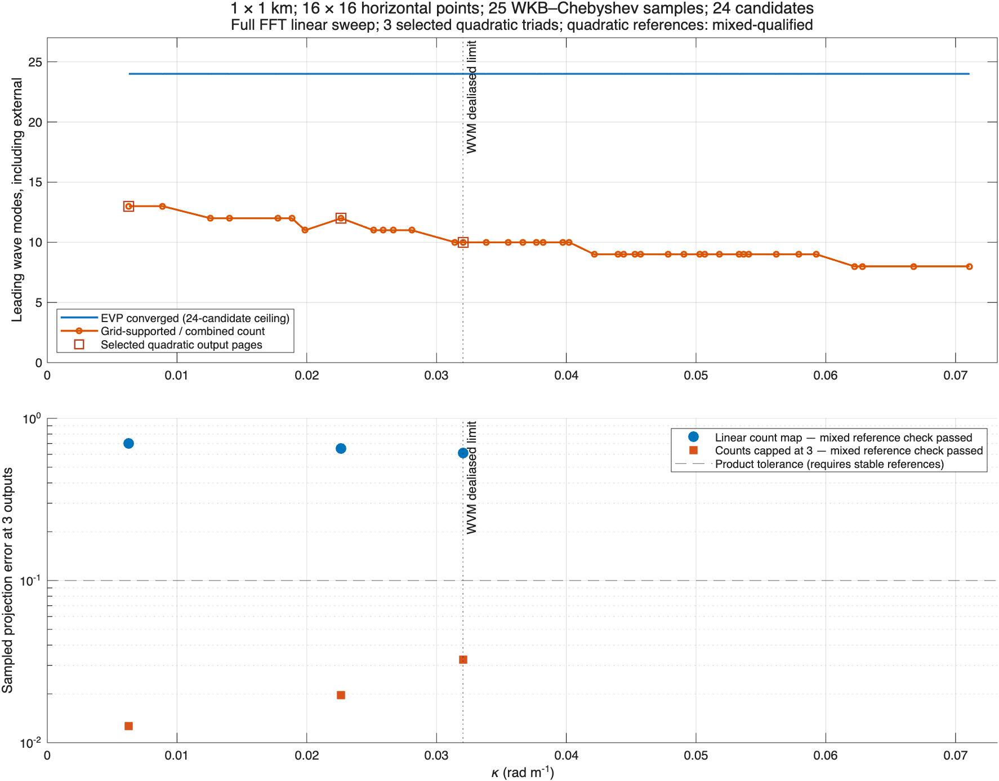

# Mixed reference qualification: recorded result

The unchanged 1 km / 16² full FFT / 25-point / 24-candidate linear sweep still gives **13 → 8** supported wave modes. Its CSV is byte-for-byte identical to the original. The sampled quadratic errors are also unchanged. Three explicit triads remain the nonlinear coverage; the figure marks WVM's smaller dealiased limit.

With the explicit `1e-10` physical-factor absolute reference allowance, all prepared references qualify. The largest mixed-budget fraction is **0.01975** (about 2% of the budget). **22 individual products** need the absolute allowance; their original relative discrepancies remain reported. Disabling the absolute allowance still yields reference-inconclusive evidence, as recorded in [strict-reference-control.json](strict-reference-control.json).

The full linear count map still fails the quadratic sampling test. The map capped at three passes on the three tested output pages, but remains **inconclusive as a complete map** because other requested pages have no product coverage. Nothing in this correction supplies a nonlinear count curve or an arbitrary-superposition guarantee. See the [precise criterion](../../../../tools/aliasing-study/ADVISORY-API.md#mixed-reference-qualification).

## Cost and calibration

The short-wave product preparation takes **15.01 s**, retains **13.69 MiB** and estimates **344.6 MiB** of workspace within the unchanged 512 MiB budget. A repeat assessment takes **15.7 ms**. The separately reproduced [long-wave control](long-wave-control/) retains its rejected full map and passing three-mode map.

Across three repetitions, calibration preparation medians are **8.49 s** (constant) and **7.02 s** (exponential), below the 10 s target. Repeat medians are **12.1 ms** and **5.24 ms**, with **12.82 MiB** retained. The [cost ledger](benchmark/costs.csv) keeps every run. The 6² [sparse/dense control](benchmark/dense-control.csv) agrees in all **16** decisions; its largest error difference remains **1.163e-6**, below the existing 1e-4 reference allowance.

## Verification and provenance

The [test ledger](tests.csv) records **34 passing tests**, covering the established advisory checks and new tests of negligible overlap, material coefficient/norm errors, rescaling, signed endpoint weights, zeros/nonfinite references and reference-budget constraints. Existing quadratic-error values are preserved. The zero-difference regression initially exposed an empty-array edge case in the helper; the helper was corrected and the two affected tests passed on rerun. The later budget-constraint regression checks both advisory entry paths. No test failure remains.

The numerical artifacts use clean source `61d0235e` with the same released InternalModes beta.4 and OceanKit revisions recorded in each provenance file. The subsequent budget-constraint check does not change these default-configuration measurements. The [verification record](verification.json) captures the final checks. Code Analyzer reports only three existing source lookup suggestions and ten existing property-name suggestions in the older test class, verified against baseline; the documentation drift check passes with 2,358 files, 4,819 routes and zero drift. The primary figure was visually inspected. Provider, runtime, package manifest and historical diagnosis/control artifacts are unchanged.

Reproduce the default figure with `waveQuadraticResolutionExample` and the calibration with `benchmarkWaveQuadraticAssessment`, using new output directories. For the long-wave control use its recorded configuration explicitly. Setting `config.referenceAbsoluteAllowance=0` before `prepareSourceStudy` reproduces strict reference qualification. The full positive-kappa count map and its omitted output pages remain explicit in the CSV reports.
