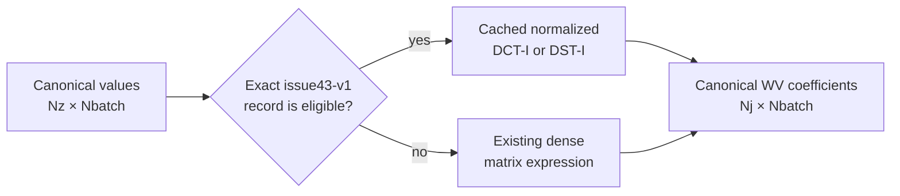

# Constant-stratification vertical transforms

`WVVerticalTransformConstantStratification` is the strategy boundary between the constant-stratification model and its vertical DCT-I/DST-I implementation. It receives only canonical vertical arrays, chooses a validated FFTW plan when the exact operation is eligible, and otherwise evaluates the existing dense matrix expression. It has no knowledge of horizontal dimensions or Fourier storage.

## Canonical representations

The strategy uses vertical-first, two-dimensional arrays:

| Representation | Shape | Meaning |
|---|---:|---|
| Physical values | `[Nz,Nbatch]` | Values on the endpoint-inclusive vertical grid |
| WV coefficients | `[Nj,Nbatch]` | Retained vertical modes in canonical WV order |
| FFTW cosine coefficients | `[Nz,Nbatch]` | Complete DCT-I coefficient set |
| FFTW sine coefficients | `[Nz-2,Nbatch]` | Interior DST-I coefficient set |

`Nbatch` is whatever collection of independent columns the caller supplies. In normal WaveVortexModel use it is the canonical horizontal WV-grid count, `Nkl`; it is not derived from a full or compressed horizontal Fourier array.

## Cosine truncation and padding

The forward DCT-I returns `Nz` coefficients. WaveVortexModel retains rows `1:Nj`, exactly matching the existing truncated `DCT` matrix. This discards excluded high modes and the Nyquist coefficient.

The inverse receives `[Nj,Nbatch]` coefficients. The strategy pads the omitted rows with exact zeros, applies the normalized inverse DCT-I, and returns `[Nz,Nbatch]` values. The FFTWTransforms class owns DCT-I endpoint and Nyquist normalization; WaveVortexModel does not renormalize the raw transform.

## Sine logical zero mode

FFTW's DST-I acts on the `Nz-2` physical interior values and returns `Nz-2` interior coefficients. WaveVortexModel's canonical G grid additionally carries a logical `j=0` row:

1. Forward DST-I creates an exact zero first row and copies the first `Nj-1` interior coefficients below it.
2. Inverse DST-I removes that logical row, pads omitted interior modes with zeros, and returns `Nz` physical values with exact zero endpoints.

The physical input endpoints are ignored by the normalized FFTWTransforms DST-I contract, matching the existing matrix convention.

## Scaling ownership

The strategy performs only the normalized DCT-I or DST-I and the canonical truncation or padding described above. Modal factors such as `F_g`, `G_g`, `F_wg`, and `G_wg` remain in the geometry methods that already own them. Keeping these factors outside the strategy preserves the existing wave-vortex normalization and makes matrix and FFTW dispatch interchangeable.

## Exact eligibility

An active `fastTransform="fftw"` model queries FFTWTransforms capabilities once when the strategy is created. A vertical call uses FFTW only when all of the following are true:

- the provider is MATLAB's bundled FFTW and the loaded real-to-real module identity is validated;
- the relevant DCT-I or DST-I numerical self-test has relative error at most `1e-12`;
- the capability record uses schema `issue43-v1`;
- one record exactly matches `Nz`, real or complex data, cosine or sine family, and forward or inverse direction; and
- `Nbatch` lies inside one of that record's inclusive tested intervals.

The strategy never interpolates between `Nz` values or extrapolates beyond a measured batch interval. Ordinary ineligibility is expected and silent: the supplied matrix expression runs unchanged.

## Plans, failures, and inspection

Eligible plans are created lazily and cached by `Nz`, `Nbatch`, transform family, and data type. Forward and inverse operations share one `RealToRealTransform` plan when both directions are eligible. No array-sized MATLAB work buffer is cached.

A capability-schema exception, plan-construction failure, or execution failure falls back to the matrix result for the current call. The affected configuration is removed from the cache and blacklisted so it is not retried. The strategy emits `WaveVortexModel:FFTWVerticalTransformUnavailable` at most once during its lifetime; routine size ineligibility emits no warning.

Backend developers and benchmark tools can call `dispatchRecords()` to inspect the actual implementation, matched interval, issue #43 source record, call count, plan creation count, reuse count, and any structured fallback reason. Plan handles and mutable cache state are deliberately not exposed.

