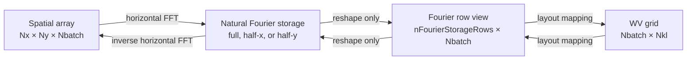

# Fourier storage layouts

`WVFourierStorageLayout` is the indexing boundary between a horizontal Fourier backend and WaveVortexModel. It lets a backend store either a full complex spectrum or the nonredundant half of a Hermitian spectrum while the rest of the model continues to use the canonical WV grid, `[Nbatch,Nkl]`.

The class describes mappings; it does not execute FFTs, normalize coefficients, own backend storage, or choose a backend. Those responsibilities remain with the fast-transform implementation.

## Representations

For a spatial array `[Nx,Ny,Nbatch]`, the supported natural Fourier-storage shapes are:

| Storage | Type | `compressedDimension` | Shape |
|---|---|---:|---|
| Full complex | `"full-complex"` | `[]` | `[Nx,Ny,Nbatch]` |
| Half-x | `"hermitian-half"` | `1` | `[floor(Nx/2)+1,Ny,Nbatch]` |
| Half-y | `"hermitian-half"` | `2` | `[Nx,floor(Ny/2)+1,Nbatch]` |

Each natural array can be viewed as `[nFourierStorageRows,Nbatch]` by combining its first two dimensions. MATLAB reshape does not change the linear ordering. Mapping arrays therefore need only two-dimensional horizontal row indices; they are not replicated over `Nbatch` or `Nz`.



## Hermitian completion

A real spatial field obeys

$$
\hat u(-k,-l) = \overline{\hat u(k,l)}.
$$

Full-complex storage contains both coefficients. Half-x storage omits negative (k); half-y storage omits negative (l). When a WV mode lies on the omitted side, `fourierRowsForConjugatedWVIndices` identifies its stored partner and `conjugatedWVIndices` identifies the WV destination that receives the conjugate.

The zero and even-grid Nyquist lines of the compressed dimension are themselves Hermitian boundaries. Along those lines, negative modes of the other dimension may still need to be written. `hermitianSourceRows` and `hermitianCompletionRows` encode those pairs. A mode at its own negative—such as zero, or a Nyquist corner on an even grid—is self-conjugate and must be real; `selfConjugateFourierRows` identifies it.

## Worked example: full complex

For `[Nx,Ny,Nbatch]=[8,6,3]`, full storage is `[8,6,3]` and its row view is `[48,3]`. `compressedDimension` is empty. Direct WV modes are gathered from `fourierRowsForDirectWVIndices`. Before an inverse FFT, primary coefficients are inserted first and Hermitian partners second. The builtin backend accesses these mapping properties directly because that exact MATLAB assignment order was measured as the fastest full-spectrum path.

## Worked example: half-x

For the same spatial grid, half-x storage is `[5,6,3]` and its row view is `[30,3]`. Modes with negative (k) are represented by the conjugate of their positive-(k), negative-(l) partner. The (k=0) and (k=4) rows require explicit completion across (l). There is no full `[8,6,3]` persistent spectrum in this representation.

## Worked example: half-y

Half-y storage is `[8,4,3]` and its row view is `[32,3]`. Modes with negative (l) are recovered from conjugated stored partners. The (l=0) and (l=3) columns require completion across (k). The canonical WV grid is unchanged; only backend storage and the mapping needed to reach it differ.

## Ownership and reassignment

The layout does not own Fourier storage. Allocating helpers return ordinary MATLAB arrays, and mapping into Fourier storage accepts a caller-owned row view. Because MATLAB may detach shared arrays through copy-on-write, always reassign the returned value:

```matlab
rows = layout.allocateFourierStorage(nBatch);
rows = layout.transformFromWVGridToFourierStorage(rows,wvArray);
```

This contract makes mutation explicit without claiming that MATLAB will always update a particular buffer in place. Backend-specific ownership and zero-copy guarantees belong to the backend implementation.

## FFTW half-x adapter

`WVFastTransformDoublyPeriodicFFTW` consumes the half-x layout with one ordered `[2 1]` `RealToComplexTransform`. Its forward call maps the allocating zero-copy half spectrum into normalized WV-grid coefficients and then releases the spectrum. Its inverse call assembles a uniquely owned transient half spectrum, crosses a helper boundary so no row-view alias remains live, and uses destructive c2r into a transient real output. The adapter retains only the FFTW plan and compact layout mappings; it retains no real- or spectrum-sized MATLAB array.

The adapter intentionally continues to use MATLAB's one-dimensional FFT implementation for `diffX` and `diffY`. Issue #74 owns the separate complete-call derivative comparison.

## Backend selection

`WVFastTransformDoublyPeriodic.create` is the boundary between canonical geometry construction and backend-specific storage. `WVGeometryDoublyPeriodic` first completes the WV mode ordering, wavenumbers, and conjugate relationships. It then asks the abstract fast-transform contract for either the builtin full-complex adapter or the FFTW half-x adapter. Geometry construction never probes a MEX gateway and never changes coefficient ordering for a backend.

The builtin path performs no FFTW discovery. For an explicit FFTW request, the static constructor queries `FFTWBackend.capabilities()`, validates the MATLAB-bundled r2c/c2r library identity, numerical self-tests, half-x ownership record, and lazy preserving-inverse scratch contract. If the modules are not ready but can be built, it makes one local build attempt and queries capabilities again. An unsuccessful request produces one actionable warning and a working builtin adapter.

Each adapter exposes `backendIdentifier` so developer tools and benchmarks can verify which implementation actually executed. Benchmark code treats fallback as an unavailable FFTW candidate rather than labeling builtin measurements as FFTW.

## Developer contract

The class is visible so backend developers can inspect its API and generated documentation. It is sealed and read-only because storage layouts are value-like descriptions, not extension points. A new backend should normally use the reshape and mapping methods. It may use the mapping properties directly when complete-expression benchmarks show that a specialized gather or assignment is materially better.

Vertically replicated mapping properties are not part of this contract. A developer who deliberately needs expanded full-layout indices may call `WVGeometryDoublyPeriodic.indicesFromWVGridToDFTGrid(...)`; ordinary builtin and FFTW transforms never materialize them.
