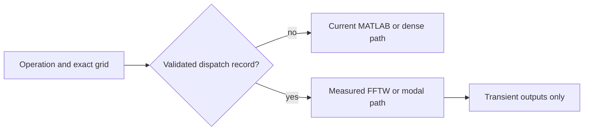

# Spatial derivative dispatch

WaveVortexModel selects spatial derivative implementations from complete-call measurements recorded by the unscored `derivative-dispatch-v1` benchmark suite. `WVSpatialDerivativeDispatch` contains exact records for the tested backend, grid shape, derivative order, and hydrostatic configuration. Untested configurations never inherit a neighboring result.

## Standalone derivatives

The ordinary MATLAB implementation remains the baseline for `diffX` and `diffY`, and dense matrices remain the baseline for `diffZF` and `diffZG`. An FFTW one-dimensional derivative is used only for an exact record where its complete allocating r2c, wavenumber multiplication, and destructive normalized c2r call was at least 10% faster.

The FFTW derivative plan is created lazily and stores no array-sized MATLAB buffer. Odd derivatives zero the compressed even-grid Nyquist coefficient so the real output matches MATLAB's symmetric inverse convention. A failed plan is deleted and blacklisted, after which the adapter uses MATLAB and emits at most one warning.

The benchmark found no validated production region where eligibility-aware FFTW DCT-I/DST-I or the FFT-extension derivative beat the existing dense vertical matrices by 10%. Standalone vertical derivatives therefore retain the dense implementation.

## Field and derivative reconstruction

The constant-stratification all-derivatives operations begin with canonical WV coefficients. Their modal candidate reconstructs the field and applies

$$
\partial_x \widehat{u} = i k\widehat{u},\qquad
\partial_y \widehat{u} = i l\widehat{u}
$$

before separate layout-specific inverse transforms. For an F field, the first vertical derivative changes from the cosine family to the sine family through $$-j\pi/L_z$$. For a G field it changes from sine to cosine through $$j\pi/L_z$$.

This route avoids transforming the reconstructed spatial field forward for `diffX`, `diffY`, and the vertical projection. It remains per-field work: issue #74 does not fuse derivatives across multiple physical variables.

## Selection and memory rules

A candidate is encoded only when it satisfies all of the following:

- complete-call median speedup of at least `1.10x`;
- relative infinity error no greater than `1e-12`;
- no persistent array-sized derivative buffer;
- no persistent full Hermitian spectrum in the FFTW backend; and
- no preserving c2r call or preserving-inverse scratch allocation.

MATLAB's internal FFT work buffers and copy-on-write behavior are reported as unresolved when no supported API exposes them. Issue #75 separately measures repeated-process resident memory for the complete backend.

