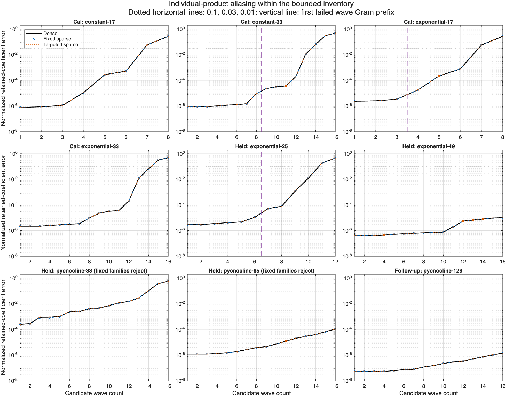

# Sparse quadratic-aliasing study: issue 400

## Recommendation

Use the fixed sparse rule as the simplest **advisory research policy** to carry into a separately reviewed assessment API. Keep the current constructor defaults and strict Gram gates. This study supports inexpensive sampled quadratic diagnostics; it does not establish a reason to relax the linear gate or automatically increase the wave count. The targeted additions cost more and do not improve any retained-count decision on this matrix.

Both frozen sparse rules reproduce all 12 calibration and all 12 reference-qualified withheld quadratic-only count decisions, with zero observed false acceptance and zero count loss against the bounded dense inventory. These quadratic-only diagnostics deliberately isolate sampling coverage. Two withheld pycnocline configurations still fail their independent fixed-family Gram gates, so they are rejected configurations, not usable retained-count successes. The separate Nz=129 resolution follow-up passes those gates and both selectors match its three candidate-band decisions.

The actual policies retain the existing Gram gate. All three policies, including linear-only, select the same wave counts on every admissible small case. The gate loses 3–6 modes relative to the quadratic-only dense band on the original admissible cases (retaining 43–81% of that band). The observed safety of the current baseline therefore has a measurable cost. This comparison supplies no evidence that adding sparse products alone recovers that loss. Any future change to linear tolerances needs a separate numerical justification.

## Cases and count decisions

Counts below are leading prefixes within the predeclared candidate band. Values separated by slashes correspond to tolerances 0.1 / 0.03 / 0.01. “All policies” means the actual linear, fixed, and targeted policies with the common Gram gate. A dagger marks acceptance of the entire candidate band; it is a lower bound on any unrestricted largest count.

| Split and profile | Horizontal grid | Nz | Candidate waves | Dense quadratic count | Fixed / targeted quadratic counts | All policies, strict gates |
| --- | --- | ---: | ---: | --- | --- | --- |
| Calibration, constant | 8×8 | 17 | 8 | 7 / 6 / 6 | match dense | 3 / 3 / 3 |
| Calibration, constant | 8×8 | 33 | 16 | 14 / 13 / 12 | match dense | 8 / 8 / 8 |
| Calibration, exponential | 8×8 | 17 | 8 | 7 / 6 / 6 | match dense | 3 / 3 / 3 |
| Calibration, exponential | 8×8 | 33 | 16 | 14 / 13 / 12 | match dense | 8 / 8 / 8 |
| Withheld, exponential | 8×8 | 25 | 12 | 10 / 10 / 9 | match dense | 6 / 6 / 6 |
| Withheld, exponential | 8×8 | 49 | 16 | 16† / 16† / 16† | match dense | 13 / 13 / 13 |
| Withheld, pycnocline | 8×8 | 33 | 16 | 13 / 13 / 10 | match dense | reject fixed families |
| Withheld, pycnocline | 12×8 | 65 | 16 | 16† / 16† / 16† | match dense | reject fixed families |
| Resolution follow-up, pycnocline | 12×8 | 129 | 16 | 16† / 16† / 16† | match dense | 16† / 16† / 16† |

Calibration domains are 100×100 km; withheld and follow-up domains are 140×100 km. Depth is 1 km, f=1e-4 s⁻¹, and g=9.81 m s⁻². Analytic profile functions in `studyProfile.m` remain in the supported N²>f² regime. Each case declares independent APV, MDA, inertial, and two active boundary counts in `case-inventory.json`. Scientific mode labels are saved in each linear cost summary: waves/inertial use 1…n, APV includes -1, and MDA includes -1 and 0. No rejected count is silently reduced.

`results/comparison-v1/decisions.csv` records actual policy false acceptance, loss relative to the quadratic-only dense band, additional loss relative to the joint band, tested/full-plan evaluation counts, and exact worst missed interactions for every tolerance. Rejected configurations have NaN acceptance/loss scores. Their wave-only diagnostic prefixes (1 for Nz=33, 4 for Nz=65) are not accepted configurations. `quadratic-diagnostics.csv` records the distinct calculation with the linear prerequisite removed. In that diagnostic the unchecked baseline falsely accepts all 12 calibration decisions and six of the 12 withheld decisions; neither sparse selector does so. These are descriptive counts for this deliberately small matrix, not statistical reliability estimates.

For example, unchecked wave count 12 on withheld exponential Nz=25 misses an error of 0.442874 in `w*dz(u)`: wave mode 12, sign +, at integer vector [-1,-1], times wave mode 11, sign +, at [2,1], projecting to the retained wave family at [1,0]. The fixed selector reduces the quadratic prefix to 10 at tolerance 0.1. Its worst untested product at that accepted prefix is 0.0123746, mode 10 at [-2,0] times mode 9 at [2,-1], projected to wave [0,-1] through `w*dz(v)`. Every output error is a norm over the retained output coefficients, so there is no unique “limiting output mode”; the family and full output prefix identify that space.

## Metric and bounded coverage

For each individual input pair and channel, the engine compares model-grid multiplication and discrete physical projection with finer integration of the same resolved scientific modes. It measures the retained coefficient difference in the target's positive Hilbert majorant, divided by the corresponding positive reference product norm. The projection itself uses the physical signed pairing, including required endpoints. A positive fit is never substituted for it. Identically zero products are explicitly counted, and product content outside the retained output space is excluded from the numerator.

The dense inventory enumerates all retained ordered interactions with nonzero inputs and exact integer vector closure k3=k1+k2, using the actual WVM antialiasing/retention mask. There are 224 interactions on the square calibration grids, 104 on the 8×8 rectangular withheld grids, and 578 on the 12×8 grids. Direction remains explicit even when vertical modes share a magnitude page. Inventories record physical magnitudes and integer vectors, from which the domain fixes physical wavevectors.

The 13 volume terms are x/y/z advection of u, v, w, and eta, plus w eta d(log N²)/dz. The eight ordered family pairs are wave–wave; wave–APV and its reverse; wave–boundary and its reverse; APV–boundary and its reverse; boundary–boundary. Both wave frequency signs, low/external and high modes, vertical derivatives, stratification factors, and both localized boundary modes are included. Nonzero outputs use the actual generalized-energy wave source dual; zero u/v outputs use the actual inertial family and zero eta uses MDA. A mean w output is structurally absent. Individual zero-output terms are phase-aligned to real conjugate-pair forcing.

The APV provider's signed same-family FF→F, GG→F, and FG→G assessment remains a separate control. Its largest reported final-prefix error across these nine cases is 9.72e-5, below all three product tolerances. APV/boundary output source coefficients, boundary sheet evolution, sums of different channels, arbitrary superpositions, and a complete nonlinear Boussinesq operator are outside this bounded study. A small maximum over these individual products is neither an operator bound nor a trajectory-error promise.

## Independent reference qualification

Admission requires equivalent-depth and positive H1 mode/derivative convergence at 1e-6, reference-quadrature stability at 1e-4, and independently solved EVP product-reference stability at 1e-4. The latter allowance is 1% of the strictest tested product tolerance. Each H1 norm is integral(|F|²+D²|F′|²), or its G counterpart, with physical depth D. Original componentwise relative derivative discrepancies remain in the output; tiny near-constant derivatives make those relative numbers poorly conditioned. Crucially, the independent product check catches small-overlap sensitivity even if a global mode norm converges.

The initial domain pilot exposed exactly that problem: 10 km opposite-boundary overlaps had normalized EVP-product disagreement 2.55 despite globally converged modes. Those runs are preserved and excluded from scoring. The 100 km pilot qualified before calibration. This domain limitation is evidence against interpreting any selected wavenumber or tail rule as a universal certificate.

The four calibration and two exponential withheld cases use EVP orders 128/192 and independent quadratures 257/513. Their maximum mode/eigen discrepancy is 6.96e-8 and product-EVP discrepancy is 7.42e-6. Initial pycnocline references at those orders failed: mode discrepancy 2.17e-4 and product discrepancy about 8.9e-3. They remain explicitly inconclusive in `results/withheld-v1`.

The documented refinement uses EVP orders 192/256 and quadratures 513/1025, without changing either original physical grid, profile, family count, policy, margin, or acceptance allowance. A diagnostic 256/384 pair was no better, so the first converged pair was used. All three refined/follow-up cases achieve H1/eigen discrepancy 5.19e-7, product-EVP discrepancy at most 2.73e-5, and quadrature discrepancy at most 3.50e-12. Their boundary interpolation discrepancy is 4.55e-10 or less. The reference-qualified pycnocline Nz=33 quadratic counts differ materially from the original inconclusive diagnostics, demonstrating why unstable references cannot score a policy.

Reference refinement does not repair linear sampling. At Nz=65 the APV, MDA, and inertial Gram errors are respectively 1.79e-7, 1.67e-7, and 3.23e-5 against the unchanged 1e-7 limit. The separately declared Nz=129 follow-up passes; it supplements the two failed configurations and is not a replacement withheld sample. `reference-refinements.json` records that distinction. The frozen selection hashes are verified during result assembly.

The 12 new scientific/selection tests pass. Three of the four existing wave-mode controls pass; `variableModesAgreeWithIndependentShooting` fails its vertical-momentum residual limit at default EVP order 64 (2.4121e-7 versus 2e-7). A clean detached copy of the pinned baseline reproduces exactly the same failure. Supplementary analytical/shooting controls at EVP orders 128/192 agree in frequency to 7.44e-11 and mode shape to 9.76e-10 on their finest comparison grid, but their differentiated-pressure momentum residual reaches 1.12e-5. Increasing EVP order does not cure that diagnostic, consistent with the existing test's documented pressure-differentiation sensitivity. Its threshold and source are unchanged. The failed control remains a reported baseline limitation; this study does not claim all physical-residual tests or a complete wave-model qualification pass. The predeclared H1 and direct retained-product reference checks above remain the admission criteria for this comparison.

## Policy and cost interpretation

The fixed policy selects at most six positive magnitude anchors with up to four vector-geometry roles each (at most 24 interactions): larger output, cancellation, disparate scales, and transverse inputs. It stresses the first two, middle, and top three input modes, preserves all fixed-family modes and both wave signs, and reuses the cumulative tested pairs as the candidate prefix grows. The targeted policy adds at most 12 interactions ranked by geometric distance and normalized input-mode/derivative tails. Rules and zero count margin were frozen before withheld access; neither was retuned afterward.

The dense surveys contain 0.777–8.126 million nonzero products per case and take 24.6–324.4 seconds of assessment. A unique product yields all retained output coefficients; output-prefix norms reuse that result. Each nonzero product also undergoes two quadrature references and an independent-EVP reference. Structural zeros and full-plan versus stop-prefix evaluation counts are reported separately. The timing matrix executes the full candidate plan, so its product count must be compared with `candidatePlanEvaluations`, not the smaller stop-prefix counter.

Measured timings include reusable mode/reference construction separately from assessment. Construction also includes the unchanged APV control. The wave/mixed evaluation count excludes that control. Peak RSS includes MATLAB, preparation, assessment, and serialization; process wall time includes startup and output. These are single fresh-process observations on an Apple M4 Max with 128 GiB RAM, macOS 26.6.1, MATLAB R2025b Update 4. They characterize this validation harness; they are not optimized runtime-constructor costs. The full measured cost table and larger sample are in `results/comparison-v1`.

| Actual policy, nine small cases | Assessment seconds | Construction seconds | Fraction of dense products | Process peak GiB |
| --- | ---: | ---: | ---: | ---: |
| Linear | <0.0001 | 3.12–12.61 | 0% | 0.81–0.95 |
| Fixed sparse | 2.16–15.56 | 3.59–14.02 | 2.63–12.68% | 0.95–1.41 |
| Targeted sparse | 3.65–22.55 | 3.75–14.18 | 3.96–23.19% | 1.00–1.57 |

The negligible linear assessment number measures only the prefix decision after preparation has computed the Gram matrices; it is not the cost of constructing or checking modes. All 18 measured small sparse runs are compared with their matching dense survey before assembly: every stored matching input-pair/output-prefix error, every selected prefix maximum, and the exact evaluation count must agree. This validates the virtual policy replay used to compare policies on identical underlying errors.

## Larger independent spot check

The predeclared larger case has a 400×400 km domain, 32×32 horizontal grid, Nz=97, 24 candidate wave modes, APV=6, MDA=4, inertial=8, and both boundaries. There are 74,060 valid ordered interactions. Fixed selects 24, targeted selects 36, and the independent seed-400 sample draws 64 interactions with all candidate input-mode pairs. The independent set happens to overlap neither sparse set. It samples only 0.086% of the valid interaction inventory and is explicitly a spot check.

| Run | Nonzero products | Construction s | Assessment s | Process wall s | Peak GiB |
| --- | ---: | ---: | ---: | ---: | ---: |
| Linear | 0 | 32.23 | <0.0001 | 35.58 | 0.94 |
| Fixed | 371,760 | 34.59 | 27.47 | 85.59 | 1.63 |
| Targeted | 608,804 | 34.92 | 40.46 | 111.38 | 1.92 |
| Independent 64 | 2,290,348 | 35.51 | 105.63 | 153.30 | 3.19 |

All reference and independent-family gates pass. The largest EVP-product reference discrepancy among these sampled runs is 9.06e-6. Every policy and the independent sample accepts the full 24-mode candidate band at all three tolerances; this does not locate an unrestricted largest count. The maximum sampled quadratic error is 7.864814e-7 for both sparse policies, and 7.864827e-7 for the independent sample. No new failure is observed. Targeting adds 64% more products and 47% more assessment time without improving the selected count or maximum tested error.

The independent limiting interaction is wave mode 24, sign +, at [-9,4] times wave mode 23, sign +, at [8,-4], projecting to wave [-1,0] through `w*dz(u)`. The fixed selector finds the same near-limit vertical product shape at [-1,0]+[-1,0]→[-2,0]. These similar errors support the utility of the selected stresses in this case; they do not establish monotonic dependence on wavenumber or coverage of the untested interactions.

## Integration and reproducibility

`API-PROPOSAL.md` describes a stateless shared projection engine with WVM-owned source recipes and a deterministic policy layer. An advisory result should expose the “largest count passing the sampled interaction checks,” exact coverage and limiting cases, independent reference/linear/quadratic status, strict explicit-count rejection, family counts, costs, and provenance. Uniform wave counts and existing storage/persistence remain unchanged. The measured choice for a first separately reviewable increment is fixed sparse diagnostics; targeted refinement has no demonstrated count benefit here.

`README.md` provides commands and pinned dependencies. Consolidated CSV/JSON tables link to the full original inventories and reference records; raw per-product MAT files remain locally preserved and checksummed, with reproduction code versioned instead of large binary fixtures. Earlier failed/inconclusive outputs and exact compressed logs remain available. `VERIFICATION.md` records focused scientific tests, sparse replay checks, Code Analyzer, documentation, and repository-scope checks. Runtime adoption is a separate decision and is not required to complete this comparison.
