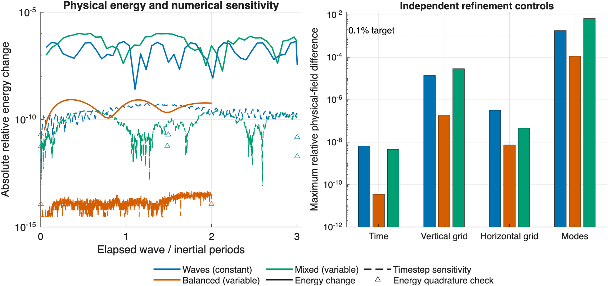

# Bounded nonlinear scientific validation (#500)

This study extends #450's short evolution evidence to three longest populated internal-wave periods (waves and mixed states) and two inertial periods (a weak balanced/boundary control). It tests the current MATLAB displacement/divergence model and its modal-pressure approximation. Only nonlinear advection is registered; there is no prescribed forcing, damping, diffusion, or state repair.

## Cases and controls

The domain is 100 km ×100 km ×1 km. Stratification is either N²=1e-4 s^-2 or N²=1e-4 exp(z/650) s^-2. `manuscriptEvolutionOperators(...).seed(scenario,0.1)` supplies the same initial physical structures used in earlier assessments, including the mean-density offsets that keep parcel labels admissible. The wave state is wave dominated; the mixed state contains all six coefficient families. The balanced case is a weak adjustment control, not an eddy-turnover or strong balanced-turbulence experiment.

The [protocol](protocol.json) declares the three cases and a 0.1% physical-field refinement target. [Cases](results/cases.csv) record the actual speeds, surface amplitudes and periods. Evolution begins at t=327 s with t0=-17 s; the elapsed duration is rounded up to a multiple of 80 s.

| Case | Stratification | Duration | Initial maximum speed | Initial RMS SSH |
| --- | --- | ---: | ---: | ---: |
| Waves | Constant | 88,720 s (24.6 h) | 0.0660 m/s | 0.157 m |
| Balanced/boundary | Exponential | 172,400 s (47.9 h) | 0.000167 m/s | 1.40e-5 m |
| Mixed | Exponential | 119,200 s (33.1 h) | 0.0923 m/s | 0.157 m |

The baseline has an 8×8×129 grid, three APV modes, four wave modes, two mean-density modes, three inertial modes, and both active endpoints. Constructors retain their existing quadratic and boundary-resolution checks. Each case has six trajectories:

- Baseline fixed RK4 with dt=20 s through the production `coefficientTendency` callback.
- Independent dt=40 and dt=10 s controls at the same inventory and grid.
- Z=257 at the same horizontal/modal inventory and dt=20 s.
- Twice the horizontal evaluation samples, with the same retained Fourier/modal inventory, Z=129 and dt=20 s. This uses the independently coded manuscript evaluator; native-grid parity is checked at initial, middle and final baseline snapshots.
- A larger inventory: 12×12×129, six APV, eight wave, four mean-density and six inertial modes at dt=20 s. This changes horizontal and vertical modal retention together, so it does not identify a single family or direction as the cause of truncation error.

No further resolution ladder is pursued when a control misses the declared target. Negative or inconclusive results are part of this bounded assessment.

## Accuracy measures

At approximately 49 common times, all trajectories are observed on the same 24×24×101 reference-coordinate grid. Errors are RMS differences in physical velocity (all three components), density and SSH. Each is normalized separately by the baseline initial RMS velocity, density anomaly relative to the no-motion density at the physical height, or SSH; a 1e-10 floor uses each quantity's own units. Background density is not used to dilute density errors. Initial mismatches are recorded separately, and different dimensional quantities are never added.

The quoted maximum is the largest normalized discrepancy over these three quantities and the common sampled times. This measures sensitivity to each declared refinement; it is not a rigorous bound against the exact continuum solution. The larger-inventory trajectory has no still-larger reference in this study and is not independently declared converged.

At initial, middle and final baseline snapshots, #450's all-family RHS assessment compares production quadrature with an independently refined split-crossing reference from #499. The reference uses 16×16×257 with 16 layer nodes; controls use 24×24×257 and 16×16×385 with 32 layer nodes in the vertical control. These checks isolate source quadrature from changes in the evolved modal inventory.

## Energy, APV and boundary evidence

Physical energy uses the stable thermodynamic interval evaluator, not cancellation-prone differences of large primitives. The baseline energy history is additionally evaluated with the same frozen modal fields on 32×32×513 points at each comparison time; 48×48×769 controls check initial, middle and final times. Native-grid recovery is asserted against `nonlinearEnergy`.

The independent manuscript diagnostics record the actual directional energy rate, its physical residual-work balance, APV-squared inventory and its rate/work balance, and surface-kinematic and endpoint-label material residuals every 80 s. APV-squared changes in the summary are normalized by f²D; endpoint residuals are in m/s. The energy time histories therefore remain distinct from coefficient-transfer bookkeeping and from an assumption of exact discrete conservation.

Final physical kinetic-energy spectra use the full Fourier transform of sqrt(gamma) times each physical velocity, with native vertical quadrature. Their nonnegative sum recovers the physical kinetic energy by an asserted Parseval check. They are not signed modal energy partitions. The baseline and larger-inventory spectra are retained as CSV evidence.

Timestep and quadrature sensitivities identify numerical contributions. Residual variation that survives those controls remains attributable to the adopted model and finite projection together. This experiment does not solve a separate nonlinear pressure problem and cannot assign the remaining error uniquely to the modal-pressure approximation.

## Results

The balanced control meets the 0.1% target throughout two inertial periods. In the wave case, timestep and quadrature controls pass, but the larger inventory changes SSH by up to 0.182%; the first sampled discrepancy above target occurs at 34,560 s (1.17 wave periods). The mixed case reaches 0.666% density, 0.554% velocity and 0.285% SSH differences, first exceeding target at 20,480 s (0.52 wave periods). These identify limits of the small inventory, not instabilities or converged error estimates for the larger inventory.

All 18 trajectories complete their declared durations without label or geometry failures. All timestep and evaluation-grid controls meet the 0.1% target. Maximum relative physical-field differences (target 1e-3) are:

| Case | Time (20 vs 10 s) | Vertical grid | Horizontal grid | Retained modes |
| --- | ---: | ---: | ---: | ---: |
| Waves | 6.62e-09 | 1.39e-05 | 3.23e-07 | 0.00182 |
| Balanced | 3.52e-11 | 1.78e-07 | 7.4e-09 | 0.000114 |
| Mixed | 4.62e-09 | 2.9e-05 | 4.6e-08 | 0.00666 |

For waves, increasing the retained inventory reduces the native diagnostic energy variation from 4.44e-7 to 5.35e-8 and the largest endpoint material residual from 8.54e-7 to 4.53e-9 m/s. This supports finite-projection sensitivity. It does not isolate pressure closure, and small energy variation alone does not establish accurate SSH.

The refined physical-energy variation is well above its independently measured quadrature uncertainty. Values below are maxima over the sampled baseline history; APV-squared changes use f²D normalization, and boundary material residuals use m/s.

| Case | Relative energy variation | Energy quadrature check | APV-squared change / f²D | Surface residual | Bottom residual |
| --- | ---: | ---: | ---: | ---: | ---: |
| Waves | 4.39e-7 | 2.05e-11 | 9.46e-12 | 7.90e-7 | 8.54e-7 |
| Balanced | 8.46e-10 | 1.15e-14 | 2.01e-19 | 3.89e-15 | 1.85e-15 |
| Mixed | 1.04e-6 | 5.88e-12 | 1.20e-9 | 1.88e-6 | 1.47e-6 |

All nine frozen-state source checks pass the #450 criterion: the largest relative family error is 5.07e-5, the largest allowance fraction is 0.051, and all independently refined references pass. The maximum normalized physical energy rate is 1.57e-9 s^-1, whereas the residual-work balance closes to 7.32e-14 s^-1. The normalized APV rate/work balance closes to 2.83e-26 s^-1. These balance identities verify the residual accounting; they do not imply the residuals vanish. Native oracle parity, native physical-energy recovery and six final spectral Parseval checks pass.

The evidence supports the weak balanced control at the declared tolerance and identifies retained-inventory limitations for the two wave-bearing cases. A future wave-bearing application at 0.1% accuracy needs a retained-mode convergence study at its intended amplitude and duration. This assessment stops at the declared bounds and makes no recommendation to change thermodynamic variables, advection form, pressure closure, or runtime defaults.



## Reproduction and verification

Baseline runtime revision: `7ce00e60` on the v5 branch. Use MATLAB R2026a and the manifest-compatible InternalModes 2.0.0-beta.4 dependencies used by #499. From the WVM authoring repository:

```matlab
addpath('tools/scientific-validation-study')
runScientificValidationStudy('/tmp/wvm-scientific-validation')
auditValidationSnapshots('/tmp/wvm-scientific-validation')
plotScientificValidation
```

Use a fresh work directory when changing the protocol or implementation. Completed MAT receipts in that directory let an unchanged study resume; they are task-local intermediates, not committed artifacts. CSVs retain the histories, errors, source-reference checks, energy quadrature and spectra used in the report and figure.

Verification ledger: MATLAB R2026a Code Analyzer is clean on the five added functions. After separating nested loop variable names, an 80 s trajectory reproduces the original diagnostics exactly. Scientific checks and complete-run status are recorded in the CSV evidence. `docs:check` validates 2,362 files and 4,827 routes without validation errors, but still reports the two pre-existing generated differences in `classes/developer-internals/wvdensitydiffusionintegrator/index.md` and `version-history.md`. No generated website files were changed.

The two-panel figure and new note page were rendered and visually checked. The note compiles without LaTeX warnings to nine pages; text on its preceding eight pages is unchanged. Whitespace, artifact and repository-scope checks pass. No production-code changes require a new simulation regression suite; the 18 trajectories and independent snapshot assertions are the directly affected scientific verification.

No production equations, runtime defaults, public APIs, website files, package manifests, released snapshots or persistence schemas are changed. This study adds no beta-release gate and does not qualify seasonal forcing, strong turbulence, finite-amplitude QG corrections, or an adaptive integrator.
