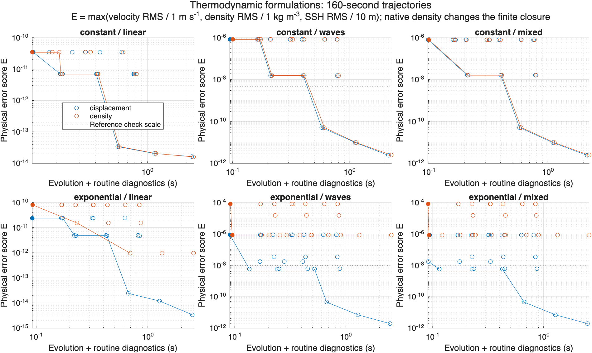

# Thermodynamic formulation assessment (#487)

**Recommendation: retain exact displacement in production.** Total density displacement is a mathematically valid alternative and agrees with exact displacement to linear order. In the tested variable-stratification cases it needs more retained modes at matched physical error, without a meaningful measured speed advantage. This assessment makes no production, public API, pressure-approximation, advection-backend, or website changes.

## What was compared

The density variable is the older notes' total density displacement h=e+alpha zeta, where rho=rho_nm(xi)+(rho0/g)N²(xi)e. It is not the main manuscript's density anomaly relative to physical height. With exact parcel displacement eta,

$$h=\eta-\tfrac12\partial_\xi\ln N^2\,(\eta-\alpha\zeta)^2+O(A^3).$$

For constant stratification, h=eta exactly. Both descriptions use the current physical-height reference pressure and p(surface)=rho0 g zeta. The older pressure split gives the same physical pressure only after its excess pressure is explicitly converted; it is not benchmarked as a different physical problem.

Three implementations separate mathematical equivalence from numerical choices:

- **Optimized displacement:** the production nonlinear source/projector with #480, #453, #484 scheduling, and #482 thermodynamics, at `cf343b95`.
- **Native density:** the same modal inventory and divergence-form advection, evolving h. Feeding h coefficients into the existing modal pressure formula changes the finite approximation; its differences are identified separately and are not attributed solely to variable choice.
- **Equivalent density control:** locally invert the time-dependent coefficient map and differentiate it along the displacement RHS. Physical fields are decoded through that inverse. This preserves the same finite displacement evolution but is a qualification reference, not a proposed efficient production algorithm.

The coefficient inverse converges in the sampled neighborhood. Its 40-second variable-stratification controls recover physical velocity to about 6e-15 m/s, density to 1e-13 kg/m³, and SSH to 2e-14 m. The native scheme is not assumed to be the same finite-dimensional system.

## Accuracy and cost evidence

The [protocol](comparison-protocol.json) fixes domain parameters, profiles, amplitudes, norms, thresholds, and cadence. The primary experiment includes 216 fixed-step RK4 trajectories of 160 seconds: constant/exponential stratification; a linear-limit control, finite-amplitude waves, and mixed waves/APV/zero-APV/inertial/mean-density states with active boundary anomalies. Horizontal samples, vertical samples, and retained modes are refined independently. Supplemental high-mode cases use smaller grids to avoid charging density for unnecessary oversampling.

Errors are absolute RMS errors in physical velocity, density, and SSH pulled back to a common reference-coordinate grid. Initialization error is included and also recorded separately. The target triples are:

| Target | Velocity, m/s | Density, kg/m³ | SSH, m |
| --- | ---: | ---: | ---: |
| 1 | 1e-3 | 1e-3 | 1e-2 |
| 2 | 1e-4 | 1e-4 | 1e-3 |
| 3 | 1e-5 | 1e-5 | 1e-4 |

Reference timestep and increased-mode checks pass the declared quarter-target criterion for all primary cases. Selection additionally includes their measured differences as an empirical margin; this is not a rigorous error bound. Points below the reference-check scale in the plot are not evidence of correspondingly resolved accuracy.

For the exponential wave/mixed cases, the small displacement inventory (3 APV, 4 wave, 2 mean-density modes) meets all three targets. Native density's density error is about 8e-5 kg/m³ there. A tested inventory of 10, 12, and 8 modes reduces that error to about 8.5e-7 kg/m³ and meets target 3, still on an 8×8×33 grid. These are tested qualifying inventories, not proven minimal mode counts.

Selected complete-trajectory timings include routine physical diagnostics every 40 seconds, exclude comparison-grid interpolation, and use medians of five alternating-order trials:

| Exponential case, target 3 | Displacement | Native density |
| --- | ---: | ---: |
| Waves | 0.0904 s | 0.0947 s |
| Mixed | 0.0939 s | 0.0926 s |

These few-percent differences do not establish a useful speed advantage. At equal resolution, complete native-density and optimized-displacement RHS times are also close. On 8×8×33 with the small inventory, representative exponential RHS medians are 2.73 ms for optimized displacement, 2.64 ms for native density, and 3.64 ms for the older corrected quadrature baseline. Comparing only with quadrature would incorrectly credit density for an improvement already available in #482. The equivalent-density reference takes about 14.4 ms in that case; its overhead is not a lower bound on other density algorithms.



Circles show the resolution/time-step sweep; filled markers use repeated selected-trajectory medians. Lines join improving observed points, not an algorithmic lower bound. See [matched-target selections](results/matched-error-costs.csv), [repeated timings](results/selected-trajectory-timings.csv), [RHS timings](results/rhs-costs.csv), and [separately timed kernels](results/kernel-costs.csv). Kernel timings are not an additive decomposition. Setup is recorded separately. All validity checks and the implemented profile inversions are included in RHS timings; forcing is absent. The profiles have closed-form inverses, so this is not evidence for general-profile inversion cost.

## Budgets, limits, and implementation implications

Volume, centered density moments, label bounds, and physical kinetic/APE/surface energy are recorded. All primary trajectories remain within the parcel domain. The [budget controls](results/budget-controls.csv) integrate the analytic energy and density-moment rates along the discrete RHS. Energy bookkeeping residuals are about 2e-14 m³/s², whereas model energy changes are around 1e-8–1e-7 m³/s² over those 40-second controls. This separates integration/bookkeeping error from invariant defects due to the finite equations and shared pressure approximation; it does not claim exact conservation. Thermodynamic forcing/work mappings and both endpoint roundoff allowances are covered by focused tests. No forced-trajectory conclusion is made.

The native buoyancy remainder simplifies to a geometry-only quantity:

$$R_h=\int_\xi^{\min(z,0)}N^2(s)\,ds-N^2(\xi)\alpha\zeta.$$

The prototype evaluates it stably with the same generic #482 evaluator and preserves the original h in the linear term when a parcel label needs its allowed roundoff adjustment. Both formulations therefore have O(HZP) generic thermodynamic work, alongside the same modal/Fourier costs. Further specialization of the fixed-label geometry evaluator is possible, but is not a measured benefit here. Density bounds can also avoid some inversions; requested physical diagnostics still need the conversion. No complexity or adoption claim is made for arbitrary profiles, other parameter regimes, long-time turbulent statistics, or other platforms.

The [2,000-second wave](results/long-waves-trajectories.csv) and [mixed](results/long-mixed-trajectories.csv) extensions cover roughly two external-wave periods and preserve this ordering. Their independent timestep/mode checks also pass the quarter-target criterion. On the small displacement inventory the maximum density errors are 6.1–6.3e-6 kg/m³, still meeting target 3. Native density on that inventory remains near 8.6e-5 kg/m³; the higher-mode small-grid candidate reaches about 8.5e-7 kg/m³. All label bounds remain valid. These longer runs are accuracy controls, not additional claims of a statistically established timing advantage.

The completed comparison supports keeping displacement: it already meets the targets with fewer modes, preserves the established closure, and is not materially slower. A future density proposal would need a demonstrated benefit in a specified regime, not another equivalence-only exercise. This issue's assessment does not authorize a production switch.

## Reproduction and supporting derivations

Runtime: MATLAB R2026a Update 4 on Apple M5 Max; [runtime metadata](results/runtime.json). InternalModes 2.0.0-beta.4, SplineCore 2.2.0, ClassAnnotations 1.2.1, NetCDF 1.0.2, and ClassDocumentation 1.3.2 are the manifest-compatible dependencies used here. Chebfun revision: `1fe01297a74d9ee765a466c3068b7fb474bee053`. WVM baseline revision: `cf343b95523240a5de658dcfd309401032b9ad80`.

With those dependencies and the repository on the MATLAB path:

```matlab
addpath('tools/thermodynamic-formulation-study','tools/nonlinear-study', ...
    'tools/buoyancy-study','UnitTests/ReferenceImplementations')
runCompleteThermodynamicStudy
runSupplementalThermodynamicResolution
runThermodynamicBudgetControls
runThermodynamicCostStudy
runMatchedThermodynamicTimings
plotCompleteThermodynamicStudy
runLongThermodynamicControls
```

Then run `python3 tools/thermodynamic-formulation-study/summarizeThermodynamicStudy.py` for the matched-target table. The four `Test*Thermodynamic*` classes named in the verification ledger below provide the focused tests.

Supporting material: [grid equations and chain rule](grid-equivalence.md), [projected tendencies and pressure](projected-comparison.md), and [coefficient-map derivative](coefficient-tangent.md). Manuscript sources and equation labels are recorded there; the inspected manuscript revision is `5c8e915bc581afd48f4244ca5ac589ced75d051e`.

## Verification ledger

All 17 tests passed across `TestThermodynamicFormulationEquivalence`, `TestProjectedThermodynamicEquivalence`, `TestThermodynamicCoefficientTangent`, and `TestThermodynamicComparison`. The final expanded endpoint-roundoff method was rerun after its changes. The plot was rendered and visually inspected; text/CSV/JSON/Python syntax, finite results, local links, whitespace, and repository scope were checked. Code Analyzer found no blocking issues; five driver advisories concern setup array growth and loop variables shared with nested helpers whose uses do not overlap. No successful numerical gate was repeated without a relevant change or the final series check.

`docs:check` validated 2,362 files and 4,827 routes, then reported the same two pre-existing differences: `docs/classes/developer-internals/wvdensitydiffusionintegrator/index.md` and `docs/version-history.md`. They were preserved. Production code, public APIs, and generated website content are unchanged.
