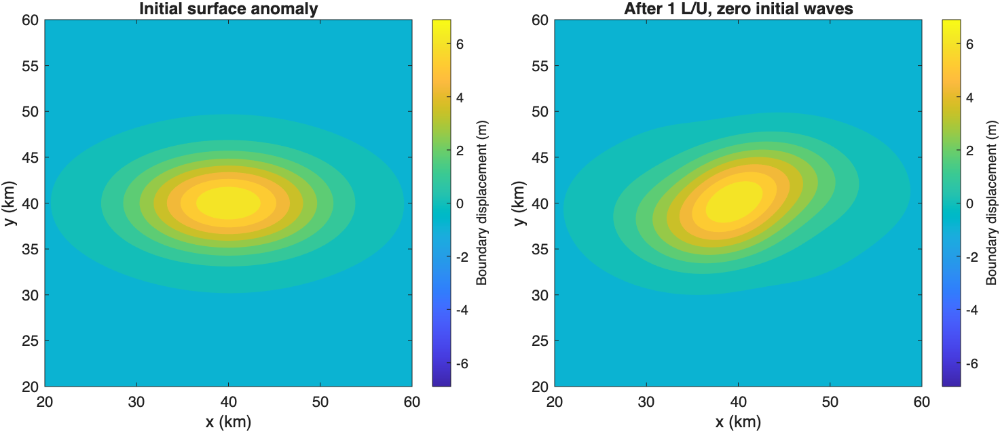

# Evolving balanced Boussinesq tolerance comparison

The family-dependent policy gives the same final coefficients and accepted-step sequences as energy scaling in all four wave-amplitude cases. Waves supply the largest normalized local error after the first step even when their initial amplitudes are zero. This explains the cost tie at the chosen tolerance scales. It neither rejects the balanced-family metric nor establishes that the wave-energy absolute budget is well calibrated. The earlier QG improvement remains relevant; a speedup in every Boussinesq case is not a sensible requirement.

## Setup

The surface anomaly is a periodic elliptical Gaussian with its horizontal mean removed, major radius 10 km, and initial 2:1 axis ratio. The domain is 80 km square and 1 km deep, with constant N² = 10⁻⁴ s⁻², latitude 30°, one active surface (`g0=-0.1`), and inactive bottom (`gd=Inf`). The vortex alone has maximum speed U = 0.03646 m/s, giving U/(fL) = 0.05. A nonparallel first-mode APV perturbation at horizontal index (1,2) has the same initial horizontal kinetic energy as the boundary component. The wave template occupies the first wave mode in two horizontal directions, with both signs, and has horizontal kinetic energy equal to that of the combined balanced state.

Only `Aw_p` and `Aw_m` are multiplied by 1, 0.1, 0.01, or zero. Their initial wave-only energy therefore scales as 1, 0.01, 0.0001, or zero; these are not fractions of total mixed-state energy. The APV, boundary, and mean-density coefficients are fixed across cases. Inertial coefficients start at zero. A fixed first MDA mode gives a 14.78 m inward surface-label offset, keeping parcel labels in the reference density interval; the inactive bottom receives no offset. The modal balanced initialization is not an exact nonlinear slow solution, and it generates adjustment waves.

The integration uses nonlinear advection only, zero beta, horizontal antialiasing, a 32×32×65 grid, four APV and four wave modes, and two inertial and two MDA modes. All cases run for one L/U = 274,269 s (about 3.17 days). This is a comparison of time integration at fixed spatial resolution, not an independent spatial qualification of the Boussinesq solution.

## Comparison and results

Both policies use ordinary WVModel/ode78, with the same 6 s initial step and maximum step equal to the interval. The energy baseline uses positive unit-coefficient physical energy. The candidate uses PV variance for `Ag_q` and endpoint displacement variance for `Ag_0`, with energy for the remaining families. Both retain the radial-bin allocation. Each dimensional family scale is calibrated once to match the energy coefficient floor at the first retained mode/column; their numerical dimensional settings are not equated. The common absolute-scale multiplier is 10⁻⁵ and R = 10⁻⁹. One matched setting per amplitude is sufficient for this controller diagnostic; it is not a complete tolerance calibration sweep.

Time references are tightened independently until their maximum field discrepancy is below 10⁻⁵. The full-wave case passes with absolute scales 10⁻⁶ and 10⁻⁷. The 10% and 1% cases require 10⁻⁷ and 10⁻⁸: their initial reference discrepancies, 1.30×10⁻⁵ and 2.21×10⁻⁵, were rejected. The zero-wave pilot already used 10⁻⁸ and 10⁻⁹ and was retained. Reference relative tolerances are 10⁻¹⁰ (10⁻¹¹ for the finest zero-wave run).

Errors are final-time relative RMS/L2 errors in velocity, PV, displacement, and boundary anomaly. Boundary normalization removes the reference horizontal mean but retains any mean error in the numerator. Thus the fixed mean-density offset cannot hide boundary errors. Both policies give the following identical results:

| Initial wave amplitude | Maximum field error | RHS evaluations | Accepted steps | Wave family has largest error |
| ---: | ---: | ---: | ---: | ---: |
| 1 | 0.000193 | 11,791 | 907 | 100.00% |
| 0.1 | 7.27e-05 | 10,465 | 805 | 100.00% |
| 0.01 | 2.22e-05 | 10,439 | 803 | 100.00% |
| 0 | 4.31e-05 | 10,439 | 803 | 99.88% |

The [complete results](evolving-comparison.csv) include individual fields, reference discrepancies, family counts, phases, and energy budgets. All trial steps are accepted. Exact equality of final coefficient arrays and accepted-step sequences is checked for each policy pair. Runtime differences between these identical integrations are not interpreted as a policy benefit; RHS counts provide the cost comparison.

For zero initial waves, `Aw_m` supplies the largest normalized error on 802 of 803 trial steps; `Ag_0` supplies the first. The tighter reference has the same pattern on 3,536 of 3,537 attempts. The boundary anomaly changes by 22% in relative RMS, and its core aspect ratio changes from 2.002 to 1.843. This exercises evolving balanced coefficients while showing that generated waves still determine the shared stepping.



*Zero initial waves, at t = 0 and L/U, with identical axes, contour levels, and color limits. The common initial surface mean is removed. Fourier interpolation to 256² points is for display only; the integration grid remains 32². The core aspect ratio uses the second moments of the positive anomaly above 10% of its peak, so rigid rotation alone would preserve it.*

The positive quadratic error norm is computed from the reconstructed error fields, including velocity, displacement, and SSH, so physical-energy cross terms are retained. Its reported value is √(E(error)/E(reference)), not the error in total energy. Nonlinear moving-volume energy changes are recorded separately and are not an acceptance criterion. The largest wave coefficients have small phase errors, but some weaker generated coefficients have order-one phase discrepancies even when their amplitudes exceed 10⁻⁶ of the family maximum. These absolute tolerances therefore meet the bulk-field target here without resolving every weak-wave phase.

This test finds no cost or accuracy penalty for the candidate at the tested setting and shared wave budget. It does not establish a Boussinesq accuracy advantage, a universal absence of one, or accuracy under spatial refinement. The QG improvement remains relevant; the observed Boussinesq cost tie has a directly measured wave-controller explanation. The subsequent [production qualification](production-qualification.md) implements an explicit family policy while preserving energy defaults.

## Absolute versus relative tolerances

Coefficient normalization and physical error-budget calibration are separate questions. The absolute array is αᵢ = Aᵢ √(wᵢ/Cᵢ), using the positive quadratic quantity of a unit coefficient. Multiplying a basis mode by s multiplies Cᵢ by |s|² and divides both its coefficient and αᵢ by |s|. The componentwise criterion is therefore normalization invariant. A small raw coefficient alone is not evidence of a small physical contribution.

However, the dimensional scales Aᵢ still need calibration. Matching one low-mode coefficient floor is a reproducible starting point, not proof of a good allocation between wave energy, PV, and boundary variance. A family that supplies the largest normalized error is restrictive under that allocation; it is not necessarily the most physically significant family.

An additional zero-initial-wave audit records R max(|a_old|,|a_new|)/α at the coefficient with largest normalized error (old state only on a retry). Values below one select the absolute branch. With the same absolute scale 10⁻⁵:

| R | Absolute-controlled attempts | Relative-controlled attempts | Largest controlling relative/absolute ratio | RHS |
| ---: | ---: | ---: | ---: | ---: |
| 10⁻⁹ | 803 | 0 | 7.61×10⁻⁸ | 10,439 |
| 10⁻³ | 803 | 0 | 0.0761 | 10,439 |

The [branch audit](evolving-branches.csv) confirms that the observed wave restriction is an absolute-budget effect at both relative settings. Some other coefficients use the relative branch at R = 10⁻³, but none supplies the largest normalized error. Normalization bookkeeping is accounted for; the physical wave-energy budget has not been optimized. Establishing whether it is unnecessarily restrictive requires varying that budget independently while holding the balanced budgets fixed and checking physical errors. Weakening initial waves alone does not answer that calibration question.

## Reproduction and verification

Use MATLAB R2026a, the WVM authoring checkout, and InternalModes beta.4 (`f2ce3c1`). As in the preceding study, the installed provider checkout lacked `assessModeConvergence.m`; these runs used the extracted beta.4 tree at `/tmp/wv-tolerances/provider` without modifying that checkout.

```matlab
addpath('tools/tolerance-study');
folder=fullfile(tempdir,'evolving-balanced-tolerances');
runEvolvingToleranceStudy(folder);
verifyToleranceTrace();
summarizeEvolvingToleranceStudy(folder);
collectEvolvingToleranceResults(string(folder),string(folder));
checkEvolvingToleranceBranches(string(folder)+"-branches");
```

The driver saves reusable references keyed by wave amplitude and absolute/relative scales, and rejects a changed physical setup or coefficient scaling in the same output directory. Use a fresh directory after changes to model or dependency code. A temporary copy of the installed ode78 records each attempted step's maximum normalized error by family. The installed solver is not edited, and neither its source nor copied private helpers belongs in the repository. A control with accepted and rejected steps gives exactly the same solver output with and without tracing.

The branch audit is saved in `/tmp/wv-tolerances/evolving-branches`. Delivered raw comparison runs are in `/tmp/wv-tolerances/evolving-pilot`, `/tmp/wv-tolerances/evolving-waves`, and `/tmp/wv-tolerances/evolving-weak`; the repository contains only drivers, the compact CSV, this report, and the figure. Code Analyzer reports no findings in the new study files. One documentation check passed: 2,364 files, 4,831 routes, zero validation failures or generated differences. The figure and source whitespace were reviewed. This follow-up changes no production code, package manifest, released snapshot, or main manuscript.
